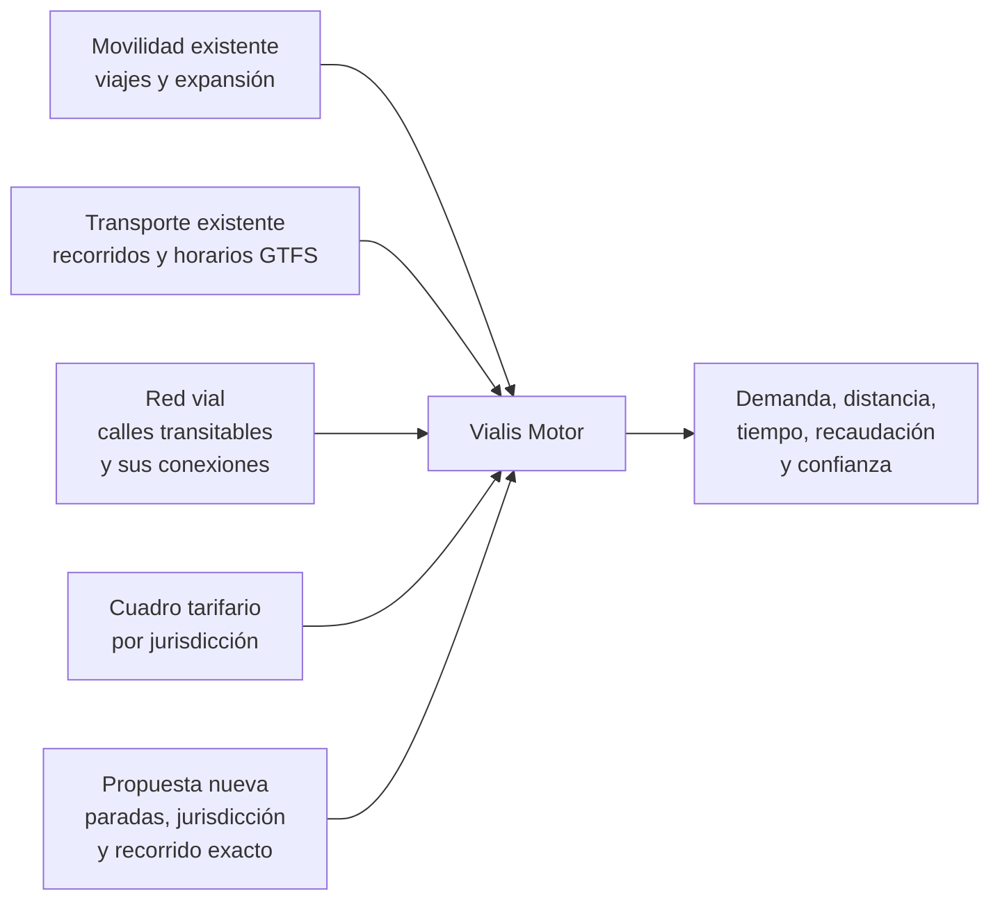
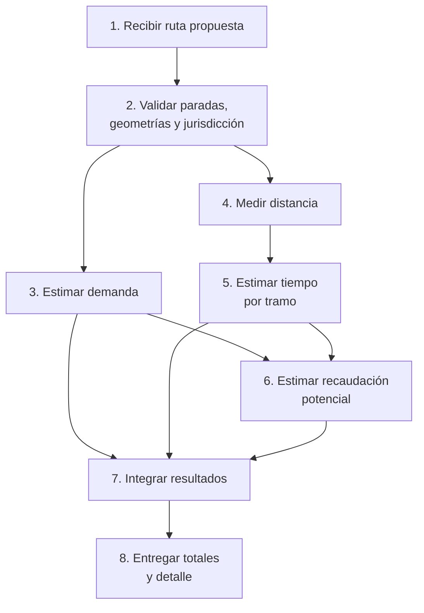
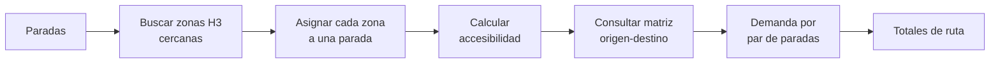
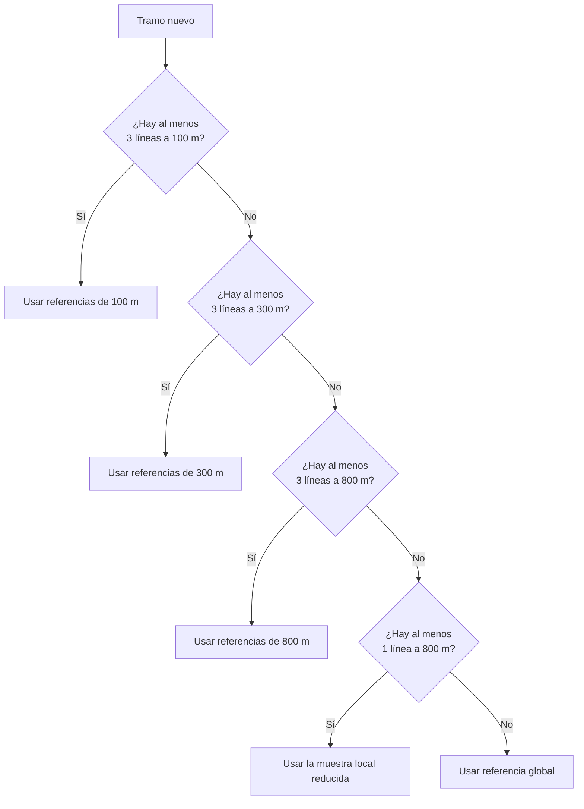
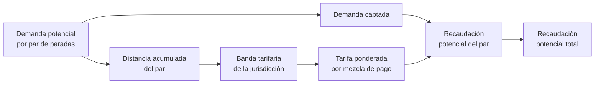
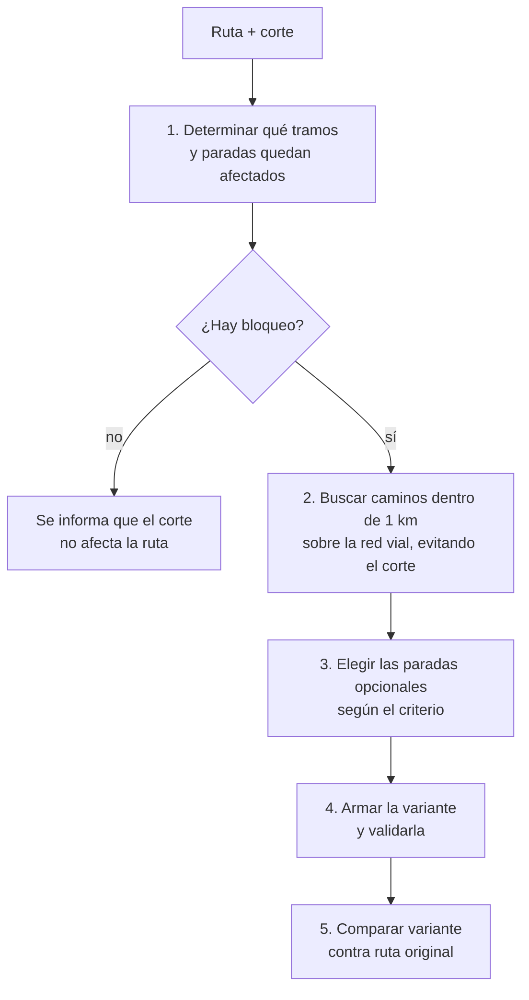
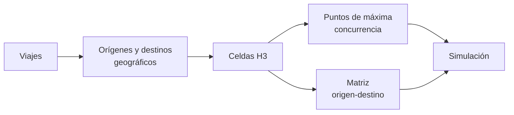
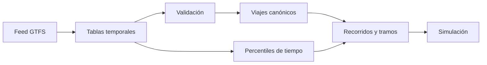
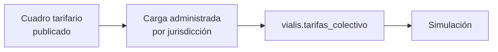
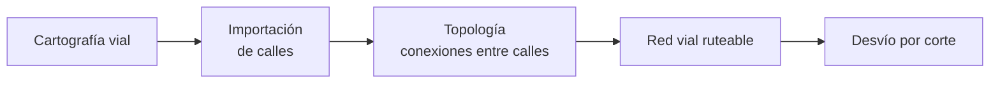

# Vialis Motor: funcionamiento de la simulación

**Alcance:** visión funcional y conceptual del motor completo  
**Estado documentado:** funcionamiento implementado actualmente
**Última actualización:** 15 de agosto de 2026

## Contenido

1. [Objetivo del motor](#1-objetivo-del-motor)
2. [Qué información utiliza](#2-qué-información-utiliza)
3. [Flujo general de una simulación](#3-flujo-general-de-una-simulación)
4. [Definición de la ruta a simular](#4-definición-de-la-ruta-a-simular)
5. [Validación de la ruta](#5-validación-de-la-ruta)
6. [Estimación de demanda](#6-estimación-de-demanda)
7. [Cálculo de distancia](#7-cálculo-de-distancia)
8. [Estimación del tiempo de viaje](#8-estimación-del-tiempo-de-viaje)
9. [Fuentes y confianza](#9-fuentes-y-confianza)
10. [Cálculo de recaudación potencial](#10-cálculo-de-recaudación-potencial)
11. [Resultado de la simulación](#11-resultado-de-la-simulación)
12. [Comparación de dos rutas](#12-comparación-de-dos-rutas)
13. [Desvíos por cortes](#13-desvíos-por-cortes)
14. [Ejemplo conceptual](#14-ejemplo-conceptual)
15. [Preparación y actualización de datos](#15-preparación-y-actualización-de-datos)
16. [Decisiones funcionales](#16-decisiones-funcionales)
17. [Alcance actual y limitaciones](#17-alcance-actual-y-limitaciones)
18. [Evolución prevista](#18-evolución-prevista)
19. [Glosario](#19-glosario)
20. [Conclusión](#20-conclusión)

## 1. Objetivo del motor

Vialis Motor permite evaluar una línea de transporte propuesta antes de su
implementación.

La entrada es una ruta ordenada, formada por paradas, el recorrido exacto
entre ellas y la jurisdicción tarifaria aplicable. A partir de esa
información, el motor estima:

- Cuántos viajes existentes podrían ser atendidos por la nueva línea.
- Qué proporción de esa demanda resulta realmente accesible desde sus paradas.
- Cuántos kilómetros recorre la línea.
- Cuánto podría demorar el viaje.
- Qué tan confiable es la estimación del tiempo en cada zona.
- Qué recaudación potencial podría generar esa demanda, según el cuadro
  tarifario de la jurisdicción y los supuestos de captación configurados.

El motor no genera el recorrido desde cero ni decide dónde deben ubicarse las
paradas. Evalúa una propuesta ya definida. La única excepción es una calle
cortada: ante una ruta que dejó de ser transitable, el motor traza el desvío que
la sortea y lo evalúa contra la original (sección 13).

Tampoco intenta predecir con exactitud la operación futura. Sus resultados son
estimaciones comparativas construidas con:

- Movilidad observada y expandida estadísticamente.
- Oferta programada de transporte público existente.
- Geometría de la ruta propuesta.
- Cuadro tarifario vigente de la jurisdicción declarada.

La finalidad principal es apoyar análisis de viabilidad y comparación de
escenarios.

### 1.1. Preguntas que responde

Para una ruta propuesta, el motor puede responder:

1. ¿Qué distancia total recorre?
2. ¿Qué zonas y movimientos de pasajeros quedan próximos a sus paradas?
3. ¿Cuál es la demanda bruta existente entre esas zonas?
4. ¿Cuál es la demanda potencial después de considerar accesibilidad?
5. ¿Cuánto demoraría el recorrido en un escenario rápido, típico o lento?
6. ¿Qué tramos tienen referencias locales sólidas?
7. ¿En qué tramos fue necesario recurrir a un promedio general?
8. ¿Qué recaudación potencial generaría, según la jurisdicción y los
   supuestos de captación y mezcla de pago configurados?
9. ¿Cuánto aporta cada parada a la demanda y a la recaudación de la ruta?
10. Frente a una ruta ya definida, ¿qué efecto tiene modificarla? (sección 12)
11. Si un corte deja intransitable parte del recorrido, ¿por dónde puede seguir
    circulando, qué paradas pierde y cuánto cuesta el rodeo? (sección 13)

### 1.2. Qué todavía no responde

En el estado actual no calcula:

- Captación real (cuántos de los pasajeros accesibles elegirían efectivamente
  la línea, más allá del supuesto fijo de captación).
- Costos operativos.
- Cantidad necesaria de vehículos.
- Frecuencia óptima.
- Comparación automática con líneas completas similares.
- Congestión en tiempo real.

Estas capacidades pueden incorporarse sobre las métricas existentes.

## 2. Qué información utiliza

El motor combina cinco grupos de información.



### 2.1. Viajes de transporte público

La base de movilidad representa viajes de un día hábil típico. Cada registro
contiene, entre otros datos:

- Origen.
- Destino.
- Modos utilizados.
- Cantidad de etapas.
- Franja horaria.
- Factor de expansión.

Una fila de la fuente no equivale necesariamente a un único viaje de toda la
población. El factor de expansión indica cuántos viajes representa
estadísticamente.

Por eso, para estimar demanda se suman factores de expansión y no solamente
filas.

### 2.2. Agregación territorial H3

Los orígenes y destinos se agrupan mediante celdas hexagonales H3 de resolución 8.

H3 permite:

- Trabajar con zonas regulares.
- Agregar viajes sin consultar cada registro individual.
- Vincular paradas con áreas cercanas.
- Construir una matriz origen-destino.

Cada celda conserva un punto de máxima concurrencia. Ese punto representa la
ubicación de mayor peso estadístico dentro del hexágono y se utiliza para medir
la accesibilidad desde las paradas.

No representa:

- El centro geométrico de la celda.
- La demanda total de toda la celda.
- Personas presentes simultáneamente.

### 2.3. Matriz origen-destino

La matriz agrega la cantidad estimada de viajes entre cada par de celdas:

```text
celda de origen → celda de destino → viajes estimados
```

La dirección importa. Los viajes de `A → B` y `B → A` son movimientos
distintos.

Esta matriz es la base del cálculo de demanda de una ruta.

### 2.4. Datos GTFS

GTFS aporta la descripción programada del transporte existente:

- Líneas y ramales.
- Sentidos de circulación.
- Viajes programados.
- Secuencias de paradas.
- Horarios de llegada y salida.
- Geometrías de recorridos.

El motor transforma esa información en referencias de tiempo comercial por
tramo.

Los horarios GTFS son programados. No son mediciones GPS ni registros de
tráfico real.

### 2.5. Red vial

La red vial describe por qué calles se puede circular y cómo se conectan entre
sí. Es lo que permite trazar un desvío cuando un corte vuelve intransitable un
tramo (sección 13): sin ella, esquivar un corte sólo podría resolverse con una
línea recta que ignora las calles.

El motor la usa exclusivamente para elegir un camino entre dos paradas. No la
usa para medir distancia, que se calcula sobre la geometría de la ruta
(sección 7), ni para estimar tiempo, que sale de las referencias GTFS
(sección 8).

Igual que la movilidad, GTFS y el cuadro tarifario, es información preparada de
antemano. Su antigüedad se traslada directamente a la calidad de los desvíos
(sección 13.9).

### 2.6. Ruta propuesta

La propuesta contiene:

- Jurisdicción tarifaria.
- Paradas ordenadas.
- Identificador de cada parada.
- Posición de cada parada.
- Recorrido exacto desde cada parada hasta la siguiente.

La ruta representa un solo sentido de circulación. Una eventual vuelta debe
simularse como otra ruta ordenada.

### 2.7. Cuadro tarifario

El cuadro tarifario define, para cada jurisdicción, bandas de distancia con
una tarifa para tarjeta registrada y una tarifa sin registrar
(`vialis.tarifas_colectivo`). Es la referencia que el motor usa para traducir
demanda potencial en recaudación potencial (sección 10).

Igual que GTFS y la movilidad, es información preparada de antemano: la
simulación no define tarifas, las consulta.

## 3. Flujo general de una simulación



### 3.1. Recepción

El motor recibe la ruta completa. No alcanza con una lista de coordenadas de
paradas: también debe conocer el camino real entre cada par consecutivo y la
jurisdicción tarifaria aplicable.

### 3.2. Validación

Se comprueba que la ruta sea coherente y pueda evaluarse sin corregirla
silenciosamente.

### 3.3. Demanda

Las paradas se vinculan con zonas H3 próximas. Después se consulta cuántos
viajes se producen entre esas zonas en el mismo sentido que la ruta.

### 3.4. Distancia

Cada recorrido entre paradas se mide geográficamente y las distancias se suman.

### 3.5. Tiempo

Cada tramo busca recorridos de transporte existentes que:

- Pasen por una zona próxima.
- Tengan una dirección similar.
- Posean tiempos programados válidos.

Esas referencias se usan para estimar tres escenarios.

### 3.6. Recaudación

Para cada par de paradas con demanda potencial se busca la banda tarifaria de
la jurisdicción declarada según la distancia acumulada de ese par, y se
aplican los supuestos de captación y mezcla de pago configurados.

### 3.7. Integración

El detalle por par de paradas y por tramo se colapsa en dos ejes: los totales
de la ruta y el aporte de cada parada (sección 11). Si la ruta es inválida o se
produce un error de datos, no se entrega un resultado parcial.

Cuando se comparan dos rutas, este flujo se ejecuta completo para cada una y
después se calcula la diferencia (sección 12). El análisis de un corte
(sección 13) agrega un paso previo —construir la variante que lo esquiva— y
termina en esa misma comparación.

## 4. Definición de la ruta a simular

### 4.1. Jurisdicción

Cada ruta declara una jurisdicción tarifaria junto con las paradas: `caba`,
`province` o `national`. Determina qué cuadro tarifario se usa para calcular
la recaudación potencial (sección 10). No se infiere de las coordenadas.

```json
{
  "jurisdiction": "caba",
  "stops": []
}
```

### 4.2. Paradas ordenadas

El orden de las paradas tiene significado operativo.

Para una ruta:

```text
A → B → C → D
```

el motor considera viajes:

```text
A → B
A → C
A → D
B → C
B → D
C → D
```

No considera automáticamente viajes en sentido contrario.

### 4.3. Recorrido hacia la siguiente parada

Cada parada, salvo la última, contiene un recorrido `PathToNext`.

```text
Parada A
  └── recorrido A → B
Parada B
  └── recorrido B → C
Parada C
  └── sin recorrido siguiente
```

El formato geográfico es un `LineString` GeoJSON.

Esta representación permite:

- Medir cada tramo por separado.
- Adaptar la velocidad estimada a cada zona.
- Identificar origen y destino del tramo.
- Sumar resultados sin volver a dividir la geometría.

### 4.4. Coordenadas

Las posiciones de parada se expresan con campos nombrados:

```json
{
  "latitude": -34.6037,
  "longitude": -58.3816
}
```

GeoJSON utiliza el orden:

```text
[longitud, latitud]
```

Ejemplo:

```json
{
  "type": "LineString",
  "coordinates": [
    [-58.3816, -34.6037],
    [-58.3764, -34.6051],
    [-58.3712, -34.6083]
  ]
}
```

### 4.5. Paradas repetidas

Una misma ubicación física puede aparecer más de una vez en un recorrido, por
ejemplo en una línea circular.

Como los identificadores deben ser únicos dentro de la simulación, cada
aparición debe distinguirse:

```text
parada-123:inicio
parada-123:regreso
```

La identidad dentro de la ruta representa una ocurrencia ordenada, no
necesariamente una parada física diferente.

## 5. Validación de la ruta

La validación protege los resultados antes de consultar demanda, tiempos o
tarifas.

### 5.1. Reglas

| Elemento | Regla |
|---|---|
| Jurisdicción | Debe ser `caba`, `province` o `national`. |
| Ruta | Debe contener al menos dos paradas. |
| Identificadores | Deben ser no vacíos y únicos. |
| Latitud | Debe ser finita y estar entre -90 y 90. |
| Longitud | Debe ser finita y estar entre -180 y 180. |
| Recorrido intermedio | Es obligatorio. |
| Última parada | No debe contener recorrido siguiente. |
| LineString | Debe tener al menos dos puntos. |
| Punto inicial | Debe quedar a no más de 20 m de la parada actual. |
| Punto final | Debe quedar a no más de 20 m de la parada siguiente. |
| Sentido | Debe ir desde la parada actual hacia la siguiente. |
| Longitud | Debe ser mayor que cero. |

### 5.2. Tolerancia de 20 metros

La geometría no necesita empezar y terminar en exactamente el mismo valor
decimal que la parada. Se acepta una diferencia de hasta 20 metros.

Esto contempla:

- Diferencias de precisión entre fuentes.
- Ubicación de la parada sobre la vereda.
- Geometría del recorrido sobre el eje de la calle.

Una diferencia mayor se considera ambigua y se rechaza.

### 5.3. Geometrías invertidas

Un tramo que va de la próxima parada hacia la actual es inválido.

El motor no lo invierte automáticamente porque hacerlo podría ocultar un error
en la construcción de la ruta.

### 5.4. Resultado de una validación fallida

El error indica qué parada, coordenada o campo incumple la regla. Ningún
cálculo de demanda, tiempo o recaudación se inicia con una entrada inválida.

## 6. Estimación de demanda

La demanda intenta medir cuántos desplazamientos existentes podrían ser
atendidos por la ruta propuesta.

No cuenta personas esperando actualmente en una parada. Parte de movimientos
origen-destino agregados para un día típico.

### 6.1. Flujo



### 6.2. Área de influencia

Cada parada tiene actualmente un radio de acceso de 800 metros.

El motor busca zonas H3 próximas y mide la distancia entre la parada y el punto
de máxima concurrencia de la zona.

Solo se aceptan puntos a menos de 800 metros. El límite exacto no se incluye.

El radio representa una distancia máxima de acceso teórica. No modela:

- Barreras físicas.
- Calidad de veredas.
- Cruces inseguros.
- Pendientes.
- Tiempo real de caminata.

### 6.3. Asignación exclusiva

Una zona puede quedar cerca de varias paradas. Para evitar doble conteo, se
asigna a una sola.

La prioridad es:

1. Parada más cercana.
2. Si existe empate, parada que aparece antes en la ruta.
3. Si el empate continúa, identificador menor.

Esto produce resultados deterministas.

También implica que agregar o mover una parada puede redistribuir zonas entre
paradas, incluso si el recorrido general no cambia.

### 6.4. Accesibilidad

La accesibilidad reduce el aporte de una zona cuando su punto principal está
lejos de la parada.

#### Método lineal

```text
accesibilidad = 1 - distancia / radio
```

Ejemplos con radio de 800 m:

| Distancia | Accesibilidad lineal |
|---:|---:|
| 0 m | 1,00 |
| 200 m | 0,75 |
| 400 m | 0,50 |
| 600 m | 0,25 |
| 800 m | 0,00 |

#### Método cuadrático

```text
accesibilidad = (1 - distancia / radio)²
```

| Distancia | Accesibilidad cuadrática |
|---:|---:|
| 0 m | 1,00 |
| 200 m | 0,5625 |
| 400 m | 0,25 |
| 600 m | 0,0625 |
| 800 m | 0,00 |

El método cuadrático es más conservador con las zonas alejadas.

### 6.5. Pares de paradas

Para cada zona asignada a una parada de origen se buscan viajes hacia zonas
asignadas a paradas posteriores.

Ejemplo:

```text
Ruta: A → B → C

Pares evaluados:
A → B
A → C
B → C
```

Los movimientos contrarios no se suman porque pertenecen al otro sentido de
circulación.

### 6.6. Demanda bruta

La demanda bruta representa los viajes expandidos registrados entre las zonas
asignadas al par de paradas:

```text
demanda bruta =
    suma de viajes de la matriz origen-destino
```

Responde a:

> ¿Cuántos viajes existentes conectan las zonas cubiertas por ambas paradas?

### 6.7. Demanda potencial

La demanda potencial pondera cada viaje por la accesibilidad de ambos extremos:

```text
demanda potencial =
    viajes
    × accesibilidad del origen
    × accesibilidad del destino
```

Ejemplo:

```text
100 viajes brutos
accesibilidad de origen = 0,8
accesibilidad de destino = 0,5

demanda potencial = 100 × 0,8 × 0,5 = 40
```

La penalización en ambos extremos refleja que un desplazamiento requiere poder
acceder razonablemente tanto a la parada de subida como a la de bajada.

### 6.8. Interpretación

La demanda potencial no debe interpretarse automáticamente como pasajeros que
elegirán la línea.

No incluye todavía:

- Preferencia modal.
- Frecuencia del servicio.
- Transbordos.
- Competencia con otras líneas.
- Capacidad del vehículo.
- Elasticidad ante el tiempo de viaje.

El cálculo de recaudación (sección 10) aplica un factor de captación
configurable sobre esta demanda, pero ese factor es un supuesto de política,
no un modelo de elección de transporte.

Es una medida de demanda territorial accesible, útil para comparar rutas bajo
la misma metodología.

### 6.9. Ausencia de un par

Si no existen movimientos en la matriz entre las zonas asignadas, el par puede
no aparecer en el detalle. Su aporte al total es equivalente a cero.

## 7. Cálculo de distancia

### 7.1. Medición por tramo

Cada `LineString` se mide como una geometría geográfica sobre la superficie
terrestre.

La distancia no se calcula:

- Como línea recta entre paradas.
- Sumando distancias cartesianas en grados.
- Usando una distancia declarada manualmente.

Se sigue toda la geometría proporcionada.

### 7.2. Total

```text
distancia total =
    distancia A → B
  + distancia B → C
  + distancia C → D
```

El detalle por tramo permite:

- Detectar tramos desproporcionados.
- Calcular tiempos locales.
- Determinar la banda tarifaria de cada par de paradas (sección 10.3).
- Explicar el total.

### 7.3. Unidad

La salida usa metros para evitar pérdida de precisión:

```text
totalDistanceMeters
```

La presentación puede convertir el valor a kilómetros:

```text
kilómetros = metros / 1000
```

## 8. Estimación del tiempo de viaje

El tiempo se estima observando cómo están programadas las líneas existentes en
zonas similares.

No se aplica una única velocidad a todo el recorrido.

### 8.1. Por qué se calcula por tramo

La velocidad comercial cambia según:

- Tipo de vía.
- Densidad de intersecciones.
- Cantidad de detenciones.
- Configuración urbana.
- Características operativas de la zona.

Una ruta puede atravesar:

```text
zona rápida → zona céntrica lenta → corredor rápido
```

Calcular cada tramo por separado permite conservar esas diferencias.

### 8.2. Construcción previa de referencias GTFS

Antes de simular, el motor procesa los viajes programados de las líneas
existentes.

Para cada línea y sentido selecciona un viaje canónico que define:

- Secuencia principal de paradas.
- Geometría principal.
- Correspondencia entre paradas y recorrido.

Se prioriza:

1. El viaje con más paradas.
2. El de mayor duración.
3. Un desempate estable por identificador.

### 8.3. Viajes comparables

Para calcular el tiempo de un tramo existente solo se usan viajes cuya
secuencia completa de paradas coincide con la del viaje canónico.

Esto evita mezclar:

- Servicios cortos.
- Variantes.
- Recorridos parciales.
- Secuencias incompatibles.

### 8.4. Qué tiempo se mide entre paradas

En un tramo intermedio se mide:

```text
salida de la parada siguiente
menos
salida de la parada actual
```

Por lo tanto, el tiempo comercial incluye la detención programada en la parada
siguiente.

En el último tramo se utiliza:

```text
llegada a la parada final
menos
salida de la parada anterior
```

Así no se agrega una detención posterior a la finalización de la línea.

Los tiempos nulos o no positivos se descartan.

### 8.5. Tres escenarios

Para cada tramo existente se calculan percentiles:

| Escenario | Estadístico | Interpretación |
|---|---:|---|
| Valle | Percentil 25 | Referencia relativamente rápida. |
| Típico | Percentil 50 | Mediana programada. |
| Pico | Percentil 75 | Referencia relativamente lenta. |

Los nombres valle, típico y pico describen escenarios estadísticos.

No significan necesariamente:

- Una franja horaria de madrugada.
- Una hora pico etiquetada.
- Tránsito medido en esos momentos.

### 8.6. Búsqueda de referencias locales

Para cada tramo nuevo se buscan tramos de líneas existentes dentro de corredores
progresivos:

```text
100 m → 300 m → 800 m
```

También deben circular en una dirección compatible. La diferencia máxima
aceptada es 60 grados.

Un recorrido que pasa por la misma calle en sentido contrario no se considera
equivalente.

### 8.7. Control de valores anómalos

Se aceptan referencias cuya velocidad comercial típica esté entre:

```text
2 km/h y 80 km/h
```

El filtro elimina:

- Tiempos imposibles o casi nulos.
- Velocidades extremadamente bajas.
- Errores de horarios.
- Referencias incompatibles con transporte urbano.

### 8.8. Peso de cada referencia

Una referencia tiene más importancia cuando:

- Se superpone con una mayor parte del tramo nuevo.
- Está más cerca de la geometría propuesta.

Conceptualmente:

```text
peso =
    proporción de superposición
    × factor de cercanía
```

Dos tramos dentro del mismo corredor no tienen necesariamente el mismo peso.

### 8.9. Una línea, un voto consolidado

Una línea existente puede aportar varios tramos próximos.

Antes de combinar distintas líneas, el motor consolida todas las referencias de
una misma línea.

Esto evita que una línea con:

- Más paradas.
- Más fragmentos.
- Mayor densidad de segmentación.

tenga más influencia solo por la forma en que fue modelada.

### 8.10. Mediana entre líneas

Después de consolidar cada línea, se obtiene una mediana ponderada para cada
escenario.

La mediana reduce la influencia de líneas excepcionalmente rápidas o lentas.

El ritmo resultante se expresa en segundos por metro y se aplica a la distancia
del tramo nuevo:

```text
tiempo del tramo =
    distancia del tramo
    × segundos por metro estimados
```

### 8.11. Selección progresiva



Se usa siempre el primer corredor que cumple la condición. Esto prioriza
similitud territorial antes que cantidad adicional de datos lejanos.

Los corredores se miden de a uno y en orden, y cada ampliación se consulta
únicamente para los tramos que el corredor anterior no logró resolver. Medir un
corredor de 800 metros es mucho más costoso que uno de 100, y en la mayoría de
los recorridos casi todos los tramos quedan resueltos en el más angosto, así
que anticipar esa medición sería trabajo que después se descarta. La regla de
selección es la misma: sólo cambia cuándo se paga cada medición.

### 8.12. Respaldo global

Si no existe ninguna referencia local, el motor utiliza una mediana global de
las líneas GTFS válidas.

El respaldo:

- Permite completar la simulación.
- Evita inventar una velocidad arbitraria.
- Se identifica explícitamente en la salida.
- Siempre tiene confianza baja.

Si la base no contiene ninguna referencia GTFS válida, la estimación no puede
realizarse.

### 8.13. Totales

Cada tiempo de tramo se redondea a segundos enteros, con un mínimo de un
segundo.

Luego:

```text
tiempo total =
    suma de los tiempos de todos los tramos
```

El procedimiento se repite para valle, típico y pico.

## 9. Fuentes y confianza

### 9.1. Confianza por tramo

| Fuente | Cantidad de líneas | Confianza |
|---|---:|---|
| `local_100m` | 3 o más | Alta |
| `local_300m` | 3 o más | Media |
| `local_800m` | 3 o más | Media |
| `local_800m` | 1 o 2 | Baja |
| `global` | Respaldo general | Baja |

### 9.2. Por qué 100 metros tiene confianza alta

Las referencias están muy próximas al recorrido nuevo y existen al menos tres
líneas independientes.

Esto no garantiza exactitud futura, pero proporciona una base local
comparativamente sólida.

### 9.3. Por qué 300 y 800 metros tienen confianza media

Existe diversidad suficiente de líneas, pero las condiciones urbanas pueden
variar dentro de un corredor más amplio.

### 9.4. Muestras pequeñas

Una o dos líneas a 800 metros permiten una aproximación local, pero no alcanzan
para considerarla robusta.

### 9.5. Confianza total

La confianza total es la peor confianza entre todos los tramos.

Ejemplo:

```text
Tramo A → B: alta
Tramo B → C: alta
Tramo C → D: baja

Confianza total: baja
```

Esta regla evita ocultar un tramo débil dentro de un promedio general.

### 9.6. Interpretación correcta

La confianza describe la calidad y proximidad de las referencias disponibles.

No es:

- Una probabilidad de acertar.
- Un intervalo estadístico.
- Una garantía de puntualidad.
- Una medición de calidad del servicio.

## 10. Cálculo de recaudación potencial

La recaudación potencial estima qué ingresos por tarifa podría generar la
demanda potencial de la ruta, aplicando el cuadro tarifario de la jurisdicción
declarada y dos supuestos explícitos de comportamiento de pago.

### 10.1. Flujo



### 10.2. Jurisdicción y cuadro tarifario

La jurisdicción declarada en la ruta (sección 4.1) selecciona qué cuadro
tarifario aplica.

El cuadro tarifario (`vialis.tarifas_colectivo`) define, para cada
jurisdicción, bandas de distancia con:

- Distancia mínima, inclusive.
- Distancia máxima, exclusiva. La última banda de cada jurisdicción no tiene
  máximo y cubre cualquier distancia mayor.
- Tarifa con tarjeta registrada.
- Tarifa sin registrar.

Los importes se almacenan en centavos para evitar errores de redondeo. El
cuadro cargado actualmente corresponde a las tarifas AMBA publicadas para
agosto de 2026 (`sql/tarifas/insertar_tarifas_vigentes.sql`). Actualizarlo es
un proceso administrado, igual que el resto de los datos de referencia
(sección 15).

### 10.3. Distancia del par

La distancia de un par de paradas es la suma de las distancias de los tramos
`PathToNext` entre la parada de origen y la de destino, ya calculadas para la
estimación de tiempo (sección 7). No se vuelve a medir la geometría.

En una variante temporal por corte, la tarifa conserva la distancia acumulada
entre esas mismas paradas sobre el recorrido original. El rodeo modifica la
distancia operativa y el tiempo, pero no el monto que corresponde cobrar al
pasajero (sección 13.5).

### 10.4. Selección de banda

Se busca la banda cuya distancia mínima sea menor o igual a la distancia del
par y cuya distancia máxima sea mayor que esa distancia, o no exista. Si
ninguna banda cubre la distancia calculada, la simulación falla
explícitamente en lugar de aplicar una tarifa aproximada.

### 10.5. Demanda captada

```text
demanda captada = demanda potencial del par × factor de captación
```

El factor de captación (`config.RevenueCaptureFactor`, entre 0 y 1,
actualmente 1) representa qué proporción de la demanda territorialmente
accesible se asume que efectivamente paga un viaje en la línea. Es un
supuesto de política configurable, no una estimación derivada de datos de
elección modal.

### 10.6. Mezcla de pago

```text
tarifa ponderada =
    tarifa registrada × proporción con tarjeta registrada
  + tarifa sin registrar × (1 − proporción con tarjeta registrada)
```

La proporción con tarjeta registrada (`config.RegisteredCardShare`,
entre 0 y 1, actualmente 1) refleja que buena parte de los boletos de
colectivo se paga con tarjeta registrada, a un valor distinto del de la
tarifa sin registrar.

### 10.7. Recaudación por par y total

```text
recaudación potencial del par = demanda captada × tarifa ponderada

recaudación potencial total =
    suma de la recaudación potencial de todos los pares
```

### 10.8. Interpretación

La recaudación potencial hereda las limitaciones de la demanda potencial
(sección 6.8): no incorpora evasión, elasticidad frente a la tarifa, ni
competencia con otras líneas más allá de lo que ya asume el factor de
captación. Es una cifra comparativa entre escenarios de simulación bajo los
mismos supuestos, no una proyección financiera.

## 11. Resultado de la simulación

El resultado tiene dos ejes: la ruta completa y el aporte de cada parada.

```text
Resultado
├── global
│   ├── Demanda
│   ├── Recaudación
│   └── Métricas
│       ├── Distancia total
│       └── Tiempo de viaje
└── byStop
    └── una entrada por parada
        ├── Demanda
        ├── Recaudación
        └── Tramo hacia la parada siguiente
```

### 11.1. Nivel de detalle

Internamente el motor calcula bastante más de lo que informa. La demanda y la
recaudación se derivan de cada par origen-destino, y la cantidad de pares crece
con el cuadrado de la cantidad de paradas: un recorrido de 139 paradas produce
más de 2.400 pares.

Ese detalle queda dentro del motor. Para decidir si una ruta vale la pena
alcanza con conocer la ruta en conjunto y la parte que le toca a cada parada,
que son exactamente los dos ejes de la salida.

### 11.2. Totales de la ruta

`global.demand` informa:

- `grossDemand`: demanda bruta total.
- `potentialDemand`: demanda potencial total.

`global.revenue` informa:

- `jurisdiction`: jurisdicción aplicada.
- `captureFactor` y `registeredCardShare`: supuestos de política vigentes al
  momento de la simulación.
- `potentialRevenueCents`: recaudación potencial total, en centavos.

`global.metrics` informa:

- `totalDistanceMeters`: suma de todas las geometrías.
- `travelTime`: los tres escenarios y la confianza total.

### 11.3. Aporte por parada

Cada entrada de `byStop` informa el orden y el identificador de la parada, más
tres bloques.

`demand` y `revenue` distinguen lo que **nace** en la parada de lo que **termina**
en ella:

| Campo | Significado |
|---|---|
| `demand.originGross` | Demanda bruta de los viajes que empiezan en la parada. |
| `demand.originPotential` | Lo mismo, ponderado por accesibilidad. |
| `demand.destinationGross` | Demanda bruta de los viajes que terminan en la parada. |
| `demand.destinationPotential` | Lo mismo, ponderado por accesibilidad. |
| `revenue.originPotentialCents` | Recaudación de los viajes que empiezan ahí. |
| `revenue.destinationPotentialCents` | Recaudación de los viajes que terminan ahí. |

Origen y destino se informan por separado a propósito. Cada par aporta a sus
dos paradas, así que sumar ambas columnas contaría cada viaje dos veces;
separadas, cada columna suma exactamente el total de la ruta:

```text
Σ originPotential = Σ destinationPotential = global.demand.potentialDemand
```

Además responden preguntas distintas: una parada donde la gente sube y una
donde baja justifican decisiones urbanísticas diferentes.

`segmentToNext` describe el viaje desde esa parada hasta la siguiente:
distancia, los tres tiempos, confianza, fuente y cantidad de líneas de
referencia. Es `null` en la última parada, igual que el `PathToNext` de la ruta
que se envía (sección 4.3).

Se informan **todas** las paradas, incluidas las que aportan cero. Mostrar que
una parada no aporta demanda es justamente lo que permite justificar
eliminarla.

### 11.4. Ejemplo de estructura

```json
{
  "global": {
    "demand": {
      "grossDemand": 175,
      "potentialDemand": 118
    },
    "revenue": {
      "jurisdiction": "caba",
      "captureFactor": 1,
      "registeredCardShare": 1,
      "potentialRevenueCents": 118000
    },
    "metrics": {
      "totalDistanceMeters": 1500,
      "travelTime": {
        "offPeakSeconds": 300,
        "typicalSeconds": 450,
        "peakSeconds": 600,
        "confidence": "medium"
      }
    }
  },
  "byStop": [
    {
      "stopOrder": 0,
      "stopId": "A",
      "demand": {
        "originGross": 150,
        "originPotential": 100,
        "destinationGross": 0,
        "destinationPotential": 0
      },
      "revenue": {
        "originPotentialCents": 100000,
        "destinationPotentialCents": 0
      },
      "segmentToNext": {
        "distanceMeters": 1000,
        "offPeakSeconds": 100,
        "typicalSeconds": 200,
        "peakSeconds": 300,
        "confidence": "high",
        "source": "local_100m",
        "referenceRouteCount": 3
      }
    }
  ]
}
```

Los números son ilustrativos y se muestra una sola parada.

### 11.5. Cómo leer el resultado

Una evaluación debería observar al menos:

1. Demanda potencial total.
2. Distribución de la demanda entre paradas, y si se concentra en pocas.
3. Paradas con aporte nulo o casi nulo.
4. Distancia total.
5. Tiempo típico total.
6. Diferencia entre valle y pico.
7. Tramos lentos.
8. Tramos con confianza baja.
9. Uso de respaldo global.
10. Recaudación potencial total y su distribución entre paradas.

El total por sí solo puede ocultar dónde se concentra la demanda o la
recaudación, o dónde la estimación es débil.

### 11.6. Una advertencia sobre el aporte por parada

El aporte de una parada **no** es lo que la ruta perdería si se la elimina.

Al quitar una parada, sus zonas H3 se reasignan a las paradas vecinas que
queden dentro del radio de acceso (sección 6.3), así que una parte de su
demanda se conserva. En un caso medido sobre una línea real, una parada que
aportaba 1.710 de demanda potencial de origen produjo una caída de 1.307 al
eliminarla: el resto pasó a sus vecinas.

Para saber el efecto real de una modificación hay que simular la ruta
modificada y comparar (sección 12).

## 12. Comparación de dos rutas

Modificar una línea existente —agregar paradas, eliminarlas o cambiar las
calles por las que circula— sólo tiene sentido si se puede ver el efecto de esa
modificación. Para eso el motor puede evaluar dos rutas y devolver ambos
resultados junto con la diferencia entre ellos.

### 12.1. Dos rutas completas, no un cambio declarado

La entrada son **dos rutas enteras**: una base y una propuesta. No se envía una
descripción de qué cambió.

El motor evalúa rutas, no las edita (sección 16.1). Si se enviara algo como
"eliminar la parada 8", el motor tendría que decidir por dónde pasa ahora el
recorrido entre las paradas 7 y 9, y esa decisión es de diseño, no de
evaluación: podría unir los dos tramos, tomar otra avenida, o evitar un giro
prohibido. Quien propone la modificación es quien sabe cuál corresponde.

Por eso **la geometría siempre la aporta quien consulta**. Al eliminar una
parada, el nuevo `PathToNext` del tramo resultante viene en la propuesta.

Ambas rutas se validan con las mismas reglas de la sección 5, sin excepción.

### 12.2. De dónde sale la ruta base

La ruta base suele ser una línea que ya existe. El motor guarda las líneas del
AMBA que cargó el flujo GTFS (sección 15.2) y las expone en dos endpoints de
sólo lectura: uno que las lista con su metadata —línea, ramal, sentido,
distancia, cantidad de paradas— y otro que devuelve una de ellas con sus
paradas y la geometría exacta de cada tramo, ya con la forma que acepta el
endpoint de simulación. El listado acepta un texto de búsqueda y una caja
geográfica, y se pagina.

El listado no incluye geometría. Devolver el recorrido de todas las líneas del
AMBA en una sola respuesta pesaría megabytes, y quien está eligiendo una línea
todavía no la necesita: alcanza con el nombre, el sentido y el tamaño. La
geometría se pide después, de a una línea.

El flujo completo de una modificación queda entonces así:

```text
1. listar líneas          → elegir la línea a modificar
2. consultar la línea     → ruta base, con geometría
3. modificarla            → ruta propuesta (la arma quien consulta)
4. comparar ambas         → efecto de la modificación
```

El paso 3 sigue siendo responsabilidad de quien consulta, por lo dicho en
12.1: el motor entrega la línea tal como está almacenada, no la edita.

**La ruta devuelta no trae jurisdicción.** GTFS no registra qué autoridad
tarifaria rige una línea, y el motor no la deduce de la geometría (sección
15.10). Consultar una línea es leer un dato almacenado; elegir bajo qué cuadro
tarifario evaluarla es una decisión de quien simula, y se toma recién en el
paso 4. Por eso el campo no aparece en la respuesta y hay que agregarlo antes
de simular.

**Si los datos almacenados no formaran una ruta válida, la consulta falla en
lugar de devolverla.** El flujo GTFS ubica cada parada sobre el `shape` de la
línea y recorta el tramo que va hasta la siguiente; si una parada no lograra
avanzar sobre el recorrido, ese tramo quedaría vacío y la ruta tendría un
hueco. Una ruta con un hueco no cumple las reglas de la sección 5, y el motor
no inventa la geometría faltante (sección 16.9). La ubicación monótona de las
paradas resolvió los casos que producían esto —recorridos circulares, pasadas
equivocadas y retrocesos cortos— así que sobre el feed actual del AMBA no
quedan líneas en esa condición; la respuesta de error existe para no entregar
una ruta que el endpoint de simulación rechazaría.

**Alineación de los extremos.** Hay una corrección que el motor sí aplica
sobre su propia geometría almacenada. El recorte del `shape` se hace por
fracción de la línea: el extremo de cada tramo es la *proyección* de la parada
sobre el recorrido, no la parada misma. Si una parada no cayera exactamente
sobre el `shape`, esos dos puntos diferirían y la diferencia podría superar los
20 metros que exige la validación de la sección 5. Al exportar una línea
almacenada, el motor reemplaza el primer y el último punto de cada tramo por
las coordenadas de las paradas correspondientes, y ningún punto intermedio: el
itinerario descrito no cambia.

En el feed actual del AMBA la corrección no mueve nada. Sus paradas están
exactamente sobre el `shape` de su recorrido —la distancia máxima entre una y
otro es de 0 metros sobre 139.044 tramos— así que la proyección coincide con la
parada. La alineación existe para que un feed que no cumpla esa condición no
haga inservibles las líneas almacenadas.

La tolerancia de esa corrección es mucho más amplia que los 20 metros de la
validación porque responde otra pregunta. La validación decide si quien
consulta envió geometría coherente; la alineación decide si un tramo
almacenado es reconociblemente el mismo lugar que su parada. Si la diferencia
supera la tolerancia, la línea se informa como no simulable en vez de
corregirse igual.

Esta corrección **nunca se aplica a la geometría que envía quien consulta**.
Esa se sigue validando contra los 20 metros, sin excepción: el motor puede
confiar en sus propios datos, no en una entrada.

### 12.3. Misma jurisdicción

Las dos rutas deben declarar la misma jurisdicción. Comparar resultados
calculados bajo cuadros tarifarios distintos mezclaría el efecto de la
modificación con el de un cambio de tarifa, y la diferencia dejaría de ser
atribuible a la propuesta.

El resto de los supuestos —captación, mezcla de pago, método de accesibilidad—
son configuración del motor, así que ya son idénticos para ambas.

### 12.4. Qué se informa

```text
Comparación
├── baseline   ← resultado completo de la ruta base
├── proposed   ← resultado completo de la ruta propuesta
└── delta      ← cuánto se movió cada métrica
```

Los dos resultados son idénticos en estructura al de una simulación individual
(sección 11), así que el aporte por parada de cada versión está disponible para
ver de dónde viene la diferencia.

El `delta` informa, para cada métrica:

| Campo | Significado |
|---|---|
| `baseline` | Valor en la ruta base. |
| `proposed` | Valor en la ruta propuesta. |
| `absolute` | `proposed − baseline`. |
| `relative` | Fracción de la base: `0,12` significa doce por ciento más. |

Cubre cantidad de paradas, demanda bruta y potencial, recaudación potencial,
distancia total y los tres tiempos de viaje.

### 12.5. Diferencias relativas indefinidas

Cuando el valor de la ruta base es cero, `relative` se informa como nulo.

El cociente no está definido ahí, y presentarlo como crecimiento infinito sería
engañoso: agregar demanda a una ruta que no llevaba ninguna es una ganancia
absoluta, y sólo `absolute` la describe correctamente.

### 12.6. Confianza

La confianza no se resta. Se informan las dos etiquetas:

```json
{ "baseline": "high", "proposed": "medium" }
```

Alta, media y baja son categorías ordenadas, no cantidades: la distancia entre
dos de ellas no significa nada, así que restarlas produciría un número sin
interpretación. Que una modificación baje la confianza es información
relevante, y mostrar ambos valores es la forma honesta de comunicarlo.

### 12.7. Qué observar en una comparación

Un delta favorable en demanda no alcanza por sí solo. Conviene mirar además:

1. Si el tiempo de viaje creció, y cuánto respecto de la demanda ganada.
2. Si la confianza empeoró, lo que indicaría que la propuesta pasa por zonas
   con menos referencias.
3. Cómo se redistribuyó la demanda entre paradas, comparando el `byStop` de
   ambas versiones.
4. Si la distancia cambió, lo que además puede mover la banda tarifaria de
   algunos pares (sección 10.4).

### 12.8. Limitaciones

La comparación hereda todas las limitaciones de cada simulación (sección 17).
Además:

- Ambas rutas se evalúan contra el estado actual de la base. La comparación es
  válida entre sí, pero no es una serie histórica.
- No se persiste (sección 17.10): cada comparación se calcula en el momento.
- El motor no propone modificaciones ni sugiere qué parada conviene eliminar.
  Evalúa la propuesta que recibe. La excepción es el desvío ante un corte
  (sección 13), donde la propuesta la construye el motor porque el corte la
  determina por completo (sección 16.1).

## 13. Desvíos por cortes

> **Estado:** dominio, proveedor de tráfico, repositorio pgRouting, servicio Go y
> `POST /detours` implementados. Los casos reales, la demo y las mediciones
> operativas corresponden a la fase 6 de
> [`plan_rf05_desvios.md`](plan_rf05_desvios.md).

Una calle cortada no cambia el diseño de una línea, pero le impide recorrerla.
Cuando eso ocurre la pregunta deja de ser "¿conviene esta ruta?" y pasa a ser
"¿por dónde puede circular mientras dure el corte, y qué cuesta el rodeo?".

Para responderla el motor recibe la ruta y un corte lineal, traza una variante
que lo evita y la evalúa contra la ruta original.



### 13.1. Qué es un corte

El MVP recibe exactamente un corte como `LineString` GeoJSON: una cuadra o una
sucesión de cuadras que la línea no puede atravesar. Normalmente proviene de un
path OSRM y por eso sigue calles OSM, aunque el motor tolera diferencias entre
las versiones de ambos grafos. Los puntos y polígonos, igual que múltiples
cortes en un pedido, quedan fuera del MVP.

El corte lo aporta quien consulta, marcado sobre el mapa. El motor no lo
descubre ni lo guarda: viaja en el pedido, igual que la ruta. Un corte que dejó
de existir sencillamente no se envía.

**Un corte no tiene vigencia.** El motor no interpreta fechas ni horarios:
evalúa el escenario en el que el corte recibido rige. Decidir si está vigente
es responsabilidad de quien consulta, por la misma razón que la jurisdicción
(sección 16.10): una vigencia inferida aplicaría restricciones que nadie pidió
sin que quede en evidencia.

**Un corte tampoco tiene sentido de circulación.** Una simulación representa un
solo sentido (sección 16.2), así que un corte que sólo bloquea una mano se envía
en la consulta del sentido afectado y se omite en la otra. Todo corte recibido
bloquea.

### 13.2. Qué parte de la ruta queda bloqueada

Un tramo queda bloqueado cuando su recorrido toca un corte. "Tocar" requiere
una tolerancia: un punto nunca cae exactamente sobre una línea, y dos
geometrías dibujadas por separado casi nunca se intersecan de forma exacta. Por
eso el contacto se evalúa contra un corredor configurable, inicialmente de 5
metros, del mismo modo que la validación admite una tolerancia entre una parada
y el extremo de su tramo (sección 5.2).

El `LineString` es una barrera que no se puede atravesar, no la identificación
de una calle cerrada. Toda arista que ingresa en ese corredor se excluye sin
importar su orientación: si una calle perpendicular cruza el corte, tampoco se
puede circular por ella. Una calle paralela que permanece completamente fuera
del corredor sigue disponible.

El bloqueo produce dos efectos distintos, y conviene no confundirlos:

| Qué toca el corte | Consecuencia |
|---|---|
| El recorrido entre dos paradas | El tramo se puede redibujar: hay desvío posible. |
| La ubicación de una parada | Ningún desvío la vuelve accesible: la parada se pierde. |

El primero es un problema de trazado. El segundo es una pérdida de cobertura, y
se trata en la sección 13.4.

### 13.3. Diseñar sólo lo que el corte obliga

Acá el motor hace algo que en todo el resto del documento evita: propone
geometría. La sección 16.1 explica por qué esto no abandona la separación entre
generar y evaluar. Lo que importa acá es cuán acotada es la propuesta.

La variante se construye con el cambio mínimo:

- El orden de las paradas no cambia.
- No se agregan paradas.
- No se reubican paradas.
- Los tramos que el corte no alcanza se conservan exactamente como llegaron.
- Sólo se reemplaza el recorrido de los tramos bloqueados.

Alrededor del corte se construye un área de búsqueda de 1 km. La geometría
original que queda fuera de esa área se conserva exactamente; dentro de ella se
buscan caminos sobre la red vial, descartando las calles que el corte alcanza.
El camino no puede salir del área de búsqueda: un rodeo mayor ya no se considera
un desvío local aceptable para el MVP.

Cuando el límite corta un `PathToNext` por la mitad, se conservan su prefijo y
su sufijo originales y sólo se reemplaza la porción interior. Los puntos donde
la ruta cruza el límite actúan como anclas del camino nuevo. Al proyectar una
parada o ancla sobre la red puede aparecer una separación por las distintas
versiones de OSM. La geometría incluye explícitamente ese conector y sólo lo
acepta si permanece dentro del área de búsqueda y no cruza el corredor
prohibido; no deja un salto implícito al coser ambos trazados.

Esa distinción es la que mantiene interpretable el resultado: como todo lo demás
queda igual, la diferencia entre la variante y la ruta original es atribuible al
corte y nada más.

### 13.4. Paradas forzadas y opcionales

Si una parada queda a 20 metros o menos del corte, se considera alcanzada: el
vehículo no puede detenerse donde no puede entrar. Esa parada se quita de todas
las variantes posibles.

Además, una parada cuya distancia geográfica mínima al `LineString` del corte
sea de hasta 500 metros es **opcional**. El criterio de decisión puede
saltearla para evitar que el vehículo vuelva hacia la zona afectada. Las paradas
a más de 500 metros no pueden eliminarse: si no existe un camino que las
conserve dentro del área de búsqueda, el corte no tiene variante resoluble.
Ambos radios son parámetros versionados del modelo: 500 metros para omisión de
paradas y 1 km para búsqueda vial.

El orden de las paradas conservadas nunca cambia. Cuando se omite una, el motor
rutea directamente entre las paradas o anclas conservadas que quedan a ambos
lados. Informa cuáles quitó y el efecto real que la simulación de la variante
produce sobre demanda y recaudación (sección 13.7).

**El motor no propone una parada de reemplazo.** Correr una parada para esquivar
un corte expresaría una decisión de diseño que el corte no determina.

Si se pierde la primera o la última parada, la variante arranca o termina antes.
Se informa como cualquier otra parada no cubierta, pero conviene leerlo con
atención: acortar una punta cambia qué es la línea, no sólo por dónde pasa.

### 13.5. El tráfico elige el camino; GTFS evalúa la variante

La selección del camino y la simulación responden preguntas distintas.

Para elegir el desvío más rápido, el motor consulta tiles vectoriales de tráfico
TomTom que cubran el área de búsqueda de 1 km, asocia sus segmentos con las
aristas de `vialis.calles` y calcula costos en segundos a partir de la velocidad
actual. Cuando una arista no tiene observación directa, puede usar la mediana de
entre 3 y 5 segmentos de la misma categoría vial situados a hasta 300 metros.
La respuesta distingue `tomtom_direct` de `tomtom_nearby_estimate`; si no hay
muestras suficientes, la arista no recibe una velocidad inventada. Esos costos
sólo ordenan las alternativas del corte y no reemplazan el modelo de tiempo de
la simulación.

Una vez armada, la variante se evalúa con el mismo cálculo que cualquier otra
ruta para demanda (sección 6), distancia (sección 7) y tiempo GTFS (sección 8).
La recaudación usa la demanda recalculada de la variante, pero selecciona la
banda tarifaria con la distancia del recorrido original entre las paradas que
se conservaron (sección 10.3): el pasajero no paga más porque un corte obligue
a realizar un rodeo temporal. Así, la distancia y el tiempo operativos sí
reflejan el desvío, mientras que la tarifa mantiene el camino comercial
original.

Esto mantiene comparables `baseline` y `proposed`: el tráfico responde qué
alternativa conviene ahora, mientras que GTFS describe cómo se comportaría
operacionalmente bajo la metodología estable del motor.

Los tiles se consultan una vez por coordenada de tesela y se reutilizan por
hasta 30 minutos mediante una caché por tile; el spike comparativo adoptó zoom
14 porque z15 y z16 no mejoraron la cobertura de matching. Nunca se
consulta TomTom una vez por calle. La respuesta debe registrar la fuente y
antigüedad del tráfico utilizado.

### 13.6. Criterios de optimización del MVP

El criterio se declara en la consulta y se aplica sólo a las paradas opcionales
de la sección 13.4:

| Criterio | Prioridad | Desempate |
|---|---|---|
| Menor tiempo | Menor tiempo según tráfico actual; puede omitir paradas a hasta 500 m del corte. | Menor cantidad de paradas perdidas. |
| Menor cantidad de paradas perdidas | Mayor cantidad de paradas conservadas. | Menor tiempo según tráfico actual. |

Las prioridades son lexicográficas: el desempate nunca puede empeorar el
objetivo principal. Para comparar alternativas no hace falta calcular todas las
combinaciones de paradas; como su orden no cambia, puede resolverse como un
camino sobre estados ordenados de paradas conservadas y omitidas.

`MENOR_DESVIO` queda fuera del MVP. La distancia continúa informándose en la
simulación y en el `delta`, pero no elige la variante.

### 13.7. Qué se informa

```text
Desvío
├── variant     ← la variante completa, lista para reenviar
├── uncovered   ← paradas que el corte dejó fuera, con su aporte perdido
├── baseline    ← resultado de la ruta original
├── proposed    ← resultado de la variante
└── delta       ← cuánto se movió cada métrica
```

Los últimos tres son exactamente la comparación de la sección 12: la variante es
una ruta propuesta como cualquier otra, y comparar contra la ruta original es lo
que responde "cuánto cuesta el corte".

`uncovered` lista cada parada perdida con el aporte que tenía en la ruta
original, tomado de su `byStop` (sección 11.3). Ese aporte da contexto, pero no
se presenta como pérdida atribuible individual: las zonas H3 se reasignan al
simular la variante. La pérdida efectiva total está en el `delta` entre
`baseline` y `proposed`.

**La variante se devuelve como una ruta completa**, con sus paradas, la
geometría de cada tramo y la jurisdicción declarada en la consulta, en el mismo
formato que acepta el endpoint de simulación. Quien consulta puede revisarla,
editarla y reenviarla. El motor propone el desvío; adoptarlo no es una decisión
suya.

Esa variante pasa las mismas validaciones de la sección 5, sin excepción. Una
geometría generada por el motor no tiene un permiso especial: si el trazado que
produjo no formara una ruta válida, el pedido falla en lugar de devolverla.

### 13.8. Cuando no hay variante

El motor no siempre puede responder con un desvío, y en cada caso lo dice en
lugar de aproximar:

- **Ningún tramo ni parada bloqueado.** El corte no toca la ruta. No se inventa
  un cambio: se informa que la ruta sigue siendo transitable.
- **El corte aísla el tramo.** Si dentro del área de búsqueda de 1 km no existe
  ningún camino entre las anclas o paradas obligatorias que evite todos los
  cortes, no se amplía el radio ni se devuelve una recta. El tramo se informa
  como no resoluble: una geometría fuera del límite aceptado evaluaría una
  variante distinta de la solicitada.
- **Quedan menos de dos paradas cubiertas.** La ruta deja de existir como
  recorrido y no hay nada que evaluar.
- **La topología conecta pero el tráfico no.** Se puede consultar el mismo
  subgrafo con sus costos OSM sólo para distinguir este caso de un aislamiento
  real. Se informa cobertura de tráfico insuficiente; ese camino diagnóstico
  nunca se devuelve ni participa de la selección.

### 13.9. Limitaciones

- **La red vial es un dato preparado** (sección 15.4). Su antigüedad limita la
  calidad del desvío: una calle abierta después de la última carga no se
  considera, y una cerrada de forma permanente se sigue considerando
  transitable.
- **El motor no sabe si una calle admite un colectivo.** Rutea sobre lo que la
  red representa. Ancho, altura libre, restricciones de giro, sentido único o
  prohibición de vehículos pesados se respetan sólo en la medida en que la red
  los registre. De las restricciones de giro OSM se aplican las que tienen un
  nodo como via; las que usan ways como via, las condicionales por horario y
  las ambiguas no (ver `sql/calles/README.md`). Un desvío puede ser geométricamente correcto y operativamente
  imposible, y quien consulta debería revisarlo antes de adoptarlo.
- **El desvío se resuelve tramo por tramo.** No se evalúa una reorganización
  global de la ruta que podría ser mejor que la suma de los rodeos locales.
- **Las paradas alejadas de la red no bloquean RF05.** En la carga vigente, 61
  de 43.400 paradas dentro del área quedan a más de 50 metros de una arista,
  principalmente dentro de terminales y Ciudad Universitaria. No se incorporan
  calles internas `service` sólo para acercarlas ni se rechaza el grafo por
  esos casos. Si una modificación necesita rutear hasta una de esas paradas, la
  calidad del enganche queda limitada por la red disponible; el criterio puede
  omitirla únicamente cuando esté dentro de los 500 metros habilitados.
- **No se reubican paradas** (sección 13.4).
- **Un solo sentido**, como toda simulación (sección 16.2).
- **No se persiste** (sección 17.10): cada análisis se calcula en el momento.
- Hereda además todas las limitaciones de cada simulación (sección 17) y de la
  comparación (sección 12.8).

## 14. Ejemplo conceptual

Supongamos una ruta:

```text
A → B → C
```

El tramo `A → B` recorre una avenida rápida. El tramo `B → C` atraviesa una
zona céntrica.

### 14.1. Demanda

| Par | Demanda bruta | Accesibilidad combinada | Demanda potencial |
|---|---:|---:|---:|
| A → B | 100 | 0,70 | 70 |
| A → C | 50 | 0,60 | 30 |
| B → C | 25 | 0,72 | 18 |
| **Total** | **175** | — | **118** |

### 14.2. Tiempo

| Tramo | Distancia | Ritmo típico | Tiempo típico | Fuente |
|---|---:|---:|---:|---|
| A → B | 1.000 m | 0,20 s/m | 200 s | 100 m |
| B → C | 500 m | 0,50 s/m | 250 s | 300 m |
| **Total** | **1.500 m** | — | **450 s** | — |

Una velocidad única habría ocultado que el segundo tramo es más lento.

### 14.3. Recaudación

Para simplificar, se asume una única banda tarifaria de 1.000 centavos, con
captación total y pago 100 % con tarjeta registrada (valores predeterminados):

| Par | Distancia | Demanda potencial | Tarifa ponderada | Recaudación potencial |
|---|---:|---:|---:|---:|
| A → B | 1.000 m | 70 | 1.000 centavos | 70.000 centavos |
| A → C | 1.500 m | 30 | 1.000 centavos | 30.000 centavos |
| B → C | 500 m | 18 | 1.000 centavos | 18.000 centavos |
| **Total** | — | **118** | — | **118.000 centavos** |

### 14.4. Aporte por parada

Los pares anteriores son el cálculo interno. Lo que el motor informa es el
aporte de cada parada (sección 11.3), que se obtiene agrupándolos:

| Parada | Demanda origen | Demanda destino | Recaudación origen | Recaudación destino | Tramo siguiente |
|---|---:|---:|---:|---:|---|
| A | 100 | 0 | 100.000 | 0 | 1.000 m, 200 s |
| B | 18 | 70 | 18.000 | 70.000 | 500 m, 250 s |
| C | 0 | 48 | 0 | 48.000 | — |
| **Total** | **118** | **118** | **118.000** | **118.000** | **1.500 m, 450 s** |

Las dos columnas de demanda suman 118 cada una, que es la demanda potencial
total. Sumarlas entre sí daría 236 y no correspondería a nada: cada par ya está
contado una vez como origen y otra como destino.

La parada A no recibe a nadie porque es la cabecera, y C no origina viajes
porque es la terminal. Ambas aparecen igual, con sus ceros.

### 14.5. Comparación de una modificación

Supongamos que se propone eliminar la parada B, uniendo los dos tramos en uno
solo de 1.500 metros. La ruta pasa a ser `A → C`.

El aporte de B era de 18 de demanda origen y 70 de destino, pero la ruta no
pierde 88: al desaparecer B, sus zonas H3 se reasignan a A y a C si quedan
dentro del radio de acceso, y parte de esa demanda se conserva con otra
accesibilidad. Con valores ilustrativos:

| Métrica | Base | Propuesta | Absoluto | Relativo |
|---|---:|---:|---:|---:|
| Paradas | 3 | 2 | −1 | −0,33 |
| Demanda potencial | 118 | 95 | −23 | −0,19 |
| Recaudación potencial | 118.000 | 95.000 | −23.000 | −0,19 |
| Distancia total | 1.500 m | 1.500 m | 0 | 0 |
| Tiempo típico | 450 s | 430 s | −20 | −0,04 |
| Confianza | media | media | — | — |

La distancia no cambia porque la geometría es la misma: sólo se dejó de
detener en el medio. El tiempo baja levemente al ahorrarse una detención. Y la
demanda cae 23, bastante menos que los 88 que B mostraba como aporte.

Esa diferencia entre "lo que la parada aportaba" y "lo que la ruta pierde" es
la razón por la que una modificación se evalúa simulando y comparando, y no
restando el aporte de la parada eliminada.

### 14.6. Interpretación

El escenario original sugiere:

- Una demanda potencial de 118 viajes representativos.
- Un recorrido de 1,5 km.
- Un tiempo típico de 7 minutos y 30 segundos.
- Una recaudación potencial de 118.000 centavos, bajo captación total y pago
  íntegramente con tarjeta registrada.
- Mejor respaldo en el primer tramo que en el segundo.

La modificación evaluada reduce la demanda un 19 % a cambio de 20 segundos
menos de recorrido, sin cambiar la distancia ni la confianza. Si ese
intercambio conviene depende de criterios que el motor no evalúa.

No permite concluir todavía:

- Cuántos pasajeros elegirían efectivamente la línea.
- Cuántos vehículos serían necesarios.

## 15. Preparación y actualización de datos

El motor necesita datos preparados antes de simular.

### 15.1. Flujo de movilidad



La actualización de viajes modifica:

- Zonas disponibles.
- Puntos de máxima concurrencia.
- Cantidades de la matriz.
- Demanda estimada de futuras simulaciones.

### 15.2. Flujo GTFS



Una actualización GTFS puede modificar:

- Geometrías existentes.
- Secuencias de paradas.
- Distancias.
- Tiempos de referencia.
- Cantidad de líneas disponibles en cada corredor.
- Confianza de una misma ruta simulada.

### 15.3. Flujo de tarifas



Una actualización tarifaria modifica directamente la recaudación potencial de
simulaciones futuras, sin afectar demanda ni tiempo de viaje. No existe un
proceso automatizado de sincronización con la fuente oficial: la carga se
realiza mediante un script SQL versionado
(`sql/tarifas/insertar_tarifas_vigentes.sql`) que debe actualizarse
manualmente cuando cambia el cuadro publicado.

### 15.4. Flujo de red vial



Una actualización de la red vial puede modificar:

- Qué calles existen y cuáles no.
- Cómo se conectan entre sí.
- El desvío elegido ante un mismo corte.
- La existencia misma de un desvío en zonas con pocas alternativas.

A diferencia de los otros tres flujos, este no afecta demanda, tiempo ni
recaudación de una simulación común: sólo interviene cuando hay un corte que
esquivar.

La obtención, transformación y validación de esta red están versionadas en
`sql/calles/`; su estado operativo se resume en la sección 15.7.

### 15.5. Naturaleza de las actualizaciones

La preparación no ocurre dentro de cada simulación. Es un proceso previo
administrado.

Esto permite respuestas más rápidas, pero requiere:

- Registrar qué versión de los datos está activa.
- Actualizar viajes, GTFS y tarifas con una frecuencia definida.
- Validar las cargas antes de reemplazar datos productivos.

### 15.6. Reconstrucción GTFS

La transformación GTFS actual reconstruye las tablas finales de recorridos y
paradas.

Antes de ejecutarla se debe:

- Confirmar que las tablas temporales GTFS estén pobladas.
- Respaldar datos manuales asociados a recorridos.
- Considerar que los identificadores internos pueden cambiar.

Los datos de viajes, matriz OD y tarifas no se modifican durante esa
reconstrucción.

### 15.7. Estado operativo actual

`cmd/initdb` ejecuta el pipeline completo desde una base vacía: red vial, GTFS,
viajes, agregados y tarifas. Los archivos fuente siguen siendo insumos externos
y deben estar disponibles antes de iniciar la carga.

Además:

- La red vial AMBA + 10 km y su pipeline están en `sql/calles/`; RF05 asocia
  tráfico TomTom, genera variantes sobre pgRouting y las expone en
  `POST /detours`.
- La importación de etapas individuales no está implementada.
- El cuadro tarifario no se sincroniza automáticamente con la fuente oficial;
  reemplazarlo requiere actualizar y ejecutar el script versionado.
- Las simulaciones no se persisten.
- No existe todavía un historial de versiones de datos y resultados.

## 16. Decisiones funcionales

### 16.1. Diseñar sólo lo que un corte obliga

El motor no propone paradas ni recorridos: evalúa la propuesta que recibe. Esto
mantiene separadas la generación de alternativas y su evaluación.

La única excepción es el desvío ante un corte (sección 13). Conviene precisar
por qué es una excepción y no el abandono de la regla.

Lo que la regla protege es la distancia entre **intención de diseño** y
**evaluación**. Cuando alguien dice "eliminá la parada 8", la geometría
resultante queda indeterminada: unir los dos tramos, tomar otra avenida o
esquivar un giro prohibido son todas respuestas posibles, y elegir entre ellas
expresa una intención que el motor no tiene cómo conocer. Por eso esa clase de
cambio se sigue enviando ya resuelta (sección 16.12).

Un corte no expresa una intención sino una imposibilidad. No dice qué se quiere
lograr; dice por dónde ya no se puede pasar. El objetivo queda completamente
determinado por la ruta original —parecerse a ella todo lo posible— y el corte
sólo agrega una restricción. No hay ahí una decisión de diseño que adivinar:
hay un problema con una respuesta calculable.

Por eso la excepción es acotada, y se mantiene acotada a propósito. El motor
redibuja los tramos que el corte volvió intransitables y nada más: no mueve
paradas, no agrega paradas, no reordena la ruta y no reubica la parada que
quedó dentro del corte. Cada una de esas decisiones volvería a ser diseño, y
ninguna está determinada por el corte.

### 16.2. Un sentido por simulación

La demanda y el recorrido son direccionales. Ida y vuelta deben evaluarse por
separado si sus paradas o geometrías difieren.

### 16.3. Demanda territorial

La demanda se vincula con áreas cercanas a paradas y no exclusivamente con
puntos exactos.

Esto es apropiado para analizar cobertura, aunque no reemplaza un modelo de
elección de transporte.

### 16.4. Asignación exclusiva de zonas

Evita doble contabilización, pero hace que la distribución por parada dependa
de la configuración completa de paradas.

### 16.5. Recorrido exacto

Permite medir distancia y condiciones locales sin depender de un servicio
externo de mapas.

### 16.6. Tiempo local antes que promedio global

Se priorizan referencias cercanas. El promedio global se utiliza únicamente
como respaldo.

### 16.7. Variabilidad explícita

El motor devuelve tres escenarios en lugar de un único tiempo. Esto comunica
que la operación no tiene una duración constante.

### 16.8. Procedencia visible

Fuente y confianza forman parte del resultado para que una cifra estimada no se
presente sin contexto.

### 16.9. Fallar ante geometrías inválidas

Una corrección automática podría evaluar una ruta distinta. Por eso la entrada
se rechaza y debe corregirse en origen.

### 16.10. Jurisdicción como entrada explícita

La jurisdicción tarifaria se declara en la ruta y no se infiere de las
coordenadas. Inferirla automáticamente podría aplicar una tarifa incorrecta en
zonas limítrofes sin que quede en evidencia.

### 16.11. Captación y mezcla de pago como supuestos de política

El factor de captación y la proporción de tarjeta registrada son parámetros de
configuración, no resultados calibrados con datos observados de la línea. Se
tratan igual que la política de accesibilidad (sección 6.4): valores
explícitos, documentados y versionables, no un modelo de elección de
transporte.

### 16.12. Comparar dos rutas completas, no un cambio declarado

Una modificación se expresa enviando la ruta resultante entera, no una
instrucción de qué cambiar. Es consecuencia directa de la decisión 16.1: si el
motor tuviera que interpretar "eliminar esta parada", tendría que decidir por
dónde pasa ahora el recorrido, y eso es diseñar. Quien propone el cambio es
quien sabe si corresponde unir los dos tramos, tomar otra calle o evitar un
giro prohibido.

Un corte también se declara y el motor sí actúa sobre él (sección 13), lo que
puede parecer la misma cosa. La diferencia está en qué se declara: una
modificación declara qué se quiere cambiar y deja abierto el cómo; un corte
declara qué dejó de ser posible y no deja nada abierto.

### 16.13. Un resultado del tamaño de la decisión

El motor calcula el detalle de cada par origen-destino pero no lo informa. La
cantidad de pares crece con el cuadrado de la cantidad de paradas, y ese
detalle no es lo que se mira para decidir si una ruta conviene.

La salida se organiza entonces en los dos ejes que sí sostienen una decisión:
la ruta completa y el aporte de cada parada (sección 11). Devolver menos
también es lo que hace práctico entregar dos resultados completos en una
comparación.

### 16.14. Diferencias relativas indefinidas en lugar de infinitas

Cuando una métrica vale cero en la ruta base, la diferencia relativa se informa
como nula y no como un crecimiento enorme. Un cociente indefinido presentado
como número invita a leerlo como una mejora espectacular cuando en realidad
sólo indica que antes no había nada que comparar.

### 16.15. La confianza no se resta

Alta, media y baja son categorías ordenadas, no cantidades. Una comparación
informa ambas etiquetas en lugar de su diferencia, porque la distancia entre
dos niveles no tiene interpretación (sección 12.6).

## 17. Alcance actual y limitaciones

### 17.1. Demanda y recaudación potencial no equivalen a captación real

La demanda potencial indica movimientos accesibles, no pasajeros asegurados.
La recaudación potencial (sección 10) aplica un factor de captación
configurable sobre esa demanda, pero ese factor es un supuesto de política,
no una estimación calibrada con datos de elección modal.

Faltan variables como:

- Frecuencia del servicio.
- Tiempo de espera.
- Transbordos.
- Competidores.
- Preferencias de los usuarios.
- Evasión y elasticidad frente a la tarifa.

### 17.2. Día típico

Los datos de movilidad representan un día hábil típico. No describen:

- Fines de semana.
- Eventos.
- Estacionalidad.
- Cambios recientes no incluidos en la carga.

### 17.3. Cobertura geográfica

La fuente de viajes tiene alcance AMBA. El alcance efectivo depende del archivo
cargado y no de un recorte automático del motor.

### 17.4. Accesibilidad simplificada

La distancia es geográfica y no peatonal. El modelo no conoce:

- Ríos o autopistas como barreras.
- Pasos habilitados.
- Calidad urbana.
- Seguridad.

### 17.5. Búsqueda H3 acotada

La búsqueda de demanda parte de la vecindad H3 inmediata de la parada y después
aplica el radio de 800 metros. Esta estrategia es eficiente, pero debería
revisarse si se cambia la resolución H3 o el radio.

### 17.6. Horarios programados

Los tiempos GTFS no observan:

- Demoras reales.
- Congestión.
- Cancelaciones.
- Incumplimientos.
- Variabilidad diaria no programada.

### 17.7. Dirección aproximada

La compatibilidad usa la orientación general entre extremos del tramo. En
geometrías muy curvas, la dirección local puede estar representada de forma
simplificada.

### 17.8. Cantidad de muestras

Se conserva cuántos viajes GTFS contribuyeron a cada percentil, pero esa
cantidad no aumenta automáticamente el peso de una línea durante la
simulación.

### 17.9. Cuadro tarifario sin versionado histórico

La simulación usa siempre el cuadro tarifario vigente en la base de datos al
momento de ejecutarse. No conserva tarifas históricas ni permite simular con
la tarifa de una fecha pasada.

### 17.10. Resultado no persistido

Actualmente no se guarda:

- Entrada.
- Resultado.
- Fecha.
- Versión de datos.
- Parámetros.

Dos ejecuciones en momentos distintos podrían cambiar después de actualizar la
base, sin que el motor conserve por sí mismo la comparación histórica.

### 17.11. Exposición actual

El servicio HTTP publica una comprobación de salud, el catálogo de líneas,
búsqueda de corredores similares, ranking de combinaciones, simulaciones,
comparaciones y desvíos por cortes. El contrato está documentado en
`docs/openapi.yaml`. También existe una herramienta de línea de comandos que
simula una ruta desde un archivo JSON.

### 17.12. Cálculo sincrónico

Cada consulta se resuelve dentro del mismo pedido, contra un límite de tiempo
configurable. Las dos simulaciones de una comparación se calculan en paralelo,
así que una comparación tarda aproximadamente lo mismo que la más lenta de las
dos rutas, no la suma.

La mayoría de los recorridos del AMBA se resuelven en menos de un segundo, pero
unos pocos recorridos suburbanos muy extensos —de 90 a 130 kilómetros—
requieren bastante más, porque cada uno de sus tramos atraviesa muchos
corredores existentes. Para esos casos el límite de tiempo puede quedar corto y
la respuesta ser un error de tiempo agotado.

## 18. Evolución prevista

### 18.1. Modelo de captación calibrado

El factor de captación y la mezcla de pago son actualmente parámetros fijos de
configuración (secciones 10.5 y 10.6). Pueden complementarse con un modelo que
estime captación a partir de:

- Frecuencia propuesta.
- Tiempo de espera.
- Tiempo frente a alternativas.
- Cantidad de transbordos.

Esto permitiría reemplazar el supuesto fijo por una proporción específica de
cada ruta y jurisdicción.

### 18.2. Comparación con líneas similares

Una línea existente puede considerarse similar según:

- Distancia total.
- Superposición.
- Zonas cubiertas.
- Cantidad de paradas.
- Tiempo típico.
- Demanda.
- Recaudación.

La comparación debería explicar qué criterios originaron la similitud.

### 18.3. Datos observados

Tiempos GPS o AVL podrían incorporarse con una jerarquía de fuentes:

```text
observación local
→ horario local
→ horario global
```

La salida debería mantener la procedencia.

### 18.4. Persistencia y escenarios

Guardar las simulaciones permitiría:

- Comparar alternativas.
- Reproducir resultados.
- Auditar cambios.
- Asociar cada cálculo con una versión de datos.

### 18.5. Versionado histórico de tarifas

Guardar cada cuadro tarifario con su fecha de vigencia permitiría simular con
la tarifa vigente en una fecha pasada y auditar variaciones de recaudación
potencial causadas exclusivamente por actualizaciones tarifarias.

### 18.6. Publicación mediante API

El mismo contrato puede exponerse a una aplicación web sin cambiar el
funcionamiento conceptual.

También conviene separar:

- Salud del proceso.
- Disponibilidad de la base.
- Vigencia de los datos.

## 19. Glosario

| Término | Significado |
|---|---|
| Accesibilidad | Coeficiente que reduce el aporte de una zona según su distancia a la parada. |
| Aporte por parada | Demanda y recaudación atribuidas a una parada, separadas según los viajes que nacen y los que terminan en ella. |
| Banda tarifaria | Rango de distancia con una tarifa registrada y una tarifa sin registrar definidas para una jurisdicción. |
| Demanda bruta | Viajes de la matriz entre zonas cubiertas, antes de ponderar accesibilidad. |
| Demanda captada | Demanda potencial de un par de paradas multiplicada por el factor de captación. |
| Demanda potencial | Demanda bruta ponderada por accesibilidad en origen y destino. |
| Corte | Barrera `LineString` que la línea no puede atravesar, declarada por quien consulta. |
| Delta | Diferencia entre la ruta propuesta y la ruta base, con su valor absoluto y su fracción relativa. |
| Desvío | Variante de una ruta que esquiva los cortes redibujando sólo los tramos que quedaron intransitables. |
| Factor de captación | Proporción configurable de la demanda potencial que se asume paga un viaje en la línea. |
| Factor de expansión | Peso estadístico que convierte una fila de muestra en viajes representados. |
| GTFS | Formato estándar de oferta, recorridos, paradas y horarios de transporte. |
| H3 | Sistema de indexación geográfica mediante celdas hexagonales. |
| Jurisdicción | Autoridad tarifaria aplicable a la ruta simulada (`caba`, `province` o `national`). |
| LineString | Geometría ordenada que representa un recorrido. |
| Matriz OD | Cantidad de viajes entre zonas de origen y destino. |
| Parada no cubierta | Parada de la ruta original que queda dentro de un corte y que ningún desvío puede alcanzar, por lo que la variante la pierde. |
| Percentil 25 | Valor por debajo del cual queda el 25 % de los tiempos. |
| Percentil 50 | Mediana de los tiempos. |
| Percentil 75 | Valor por debajo del cual queda el 75 % de los tiempos. |
| Recaudación potencial | Ingreso estimado por tarifa a partir de la demanda captada y la tarifa ponderada de cada par de paradas. |
| Red vial | Descripción de las calles transitables y sus conexiones, usada únicamente para trazar el desvío ante un corte. |
| Ritmo comercial | Segundos necesarios por metro recorrido, incluyendo detenciones según el criterio GTFS. |
| Ruta base | Ruta contra la que se compara una propuesta. En una modificación, la línea tal como existe hoy. |
| Tarifa ponderada | Combinación de la tarifa registrada y la tarifa sin registrar según la proporción de tarjeta registrada asumida. |
| Tramo | Recorrido desde una parada hasta la siguiente. |
| Variante | Ruta que el motor devuelve tras esquivar un corte, completa y lista para reenviarse a la simulación. |
| Viaje canónico | Viaje GTFS elegido para representar la secuencia principal de una línea y sentido. |

## 20. Conclusión

Vialis Motor evalúa una ruta nueva combinando movilidad existente, oferta de
transporte programada, geometría detallada y el cuadro tarifario de la
jurisdicción declarada.

Su funcionamiento se apoya en tres cálculos complementarios:

- La demanda determina qué movimientos territoriales podrían ser atendidos.
- La distancia y el tiempo describen el comportamiento operativo esperado.
- La recaudación potencial traduce esa demanda en un ingreso estimado, bajo
  supuestos explícitos de captación y mezcla de pago.

El resultado se organiza en dos ejes: la ruta completa y el aporte de cada
parada, con el tramo que la conecta con la siguiente. Esto permite identificar
no solo cuánta demanda, tiempo o recaudación tiene una propuesta, sino dónde se
originan esos valores y qué tan sólidas son las referencias utilizadas.

Sobre esa misma base, el motor puede evaluar dos rutas y devolver la diferencia
entre ellas (sección 12). Así una modificación de una línea existente —agregar
o quitar paradas, cambiar las calles que recorre— deja de ser un resultado
aislado y pasa a poder leerse como impacto: cuánta demanda gana o pierde,
cuánto tiempo agrega y si la estimación se vuelve menos confiable.

Sobre esa misma comparación se apoya el análisis de un corte (sección 13). Ahí
el motor da un paso que en el resto del documento evita —traza él mismo la
variante que esquiva lo intransitable— pero lo da acotado a lo que el corte
determina: redibuja los tramos bloqueados, informa qué paradas quedaron fuera y
cuánto aportaban, y deja la decisión de adoptar el desvío en manos de quien
consulta.

Las métricas actuales constituyen una base para completar la evaluación de
viabilidad con costos, comparación automática contra líneas similares y un
modelo de captación calibrado, sin perder la trazabilidad del cálculo.
