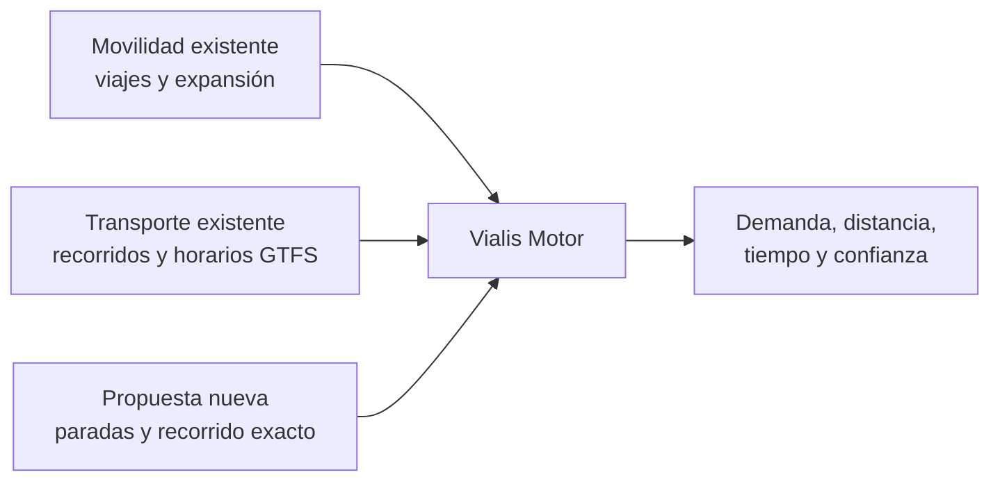
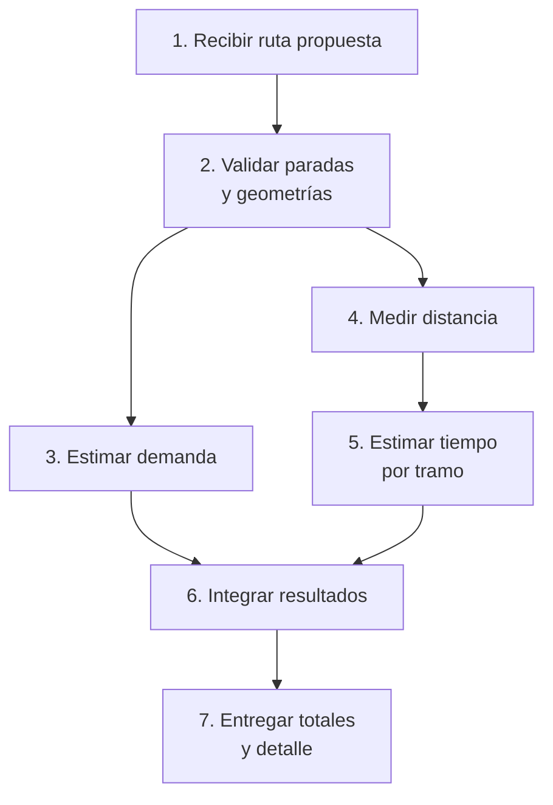
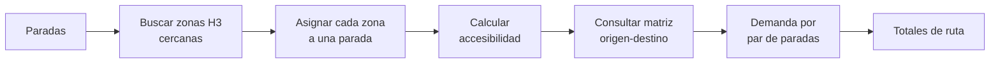
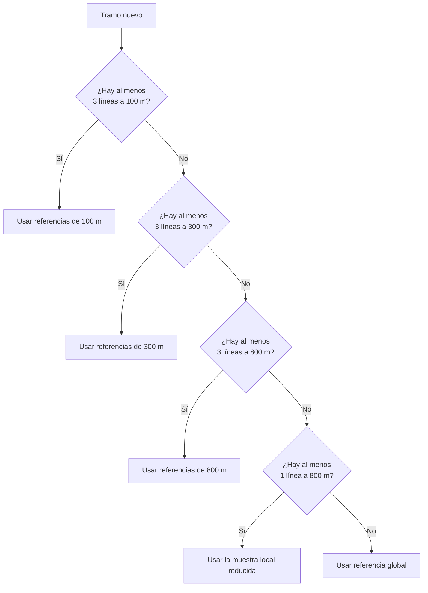
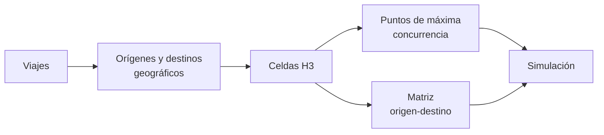
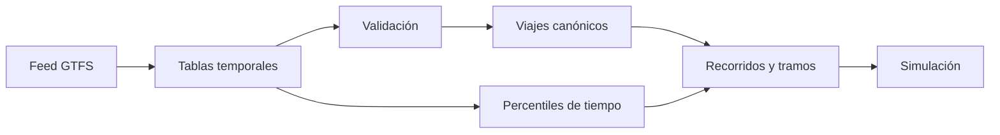

# Vialis Motor: funcionamiento de la simulación

**Alcance:** visión funcional y conceptual del motor completo  
**Estado documentado:** funcionamiento implementado actualmente  
**Última actualización:** 27 de julio de 2026

## Contenido

1. [Objetivo del motor](#1-objetivo-del-motor)
2. [Qué información utiliza](#2-qué-información-utiliza)
3. [Flujo general de una simulación](#3-flujo-general-de-una-simulación)
4. [Definición de la ruta a simular](#4-definición-de-la-ruta-a-simular)
5. [Validación de la ruta](#5-validación-de-la-ruta)
6. [Estimación de demanda](#6-estimación-de-demanda)
7. [Cálculo de distancia](#7-cálculo-de-distancia)
8. [Estimación del tiempo de viaje](#8-estimación-del-tiempo-de-viaje)
9. [Fuentes y confianza](#9-fuentes-y-confianza)
10. [Resultado de la simulación](#10-resultado-de-la-simulación)
11. [Ejemplo conceptual](#11-ejemplo-conceptual)
12. [Preparación y actualización de datos](#12-preparación-y-actualización-de-datos)
13. [Decisiones funcionales](#13-decisiones-funcionales)
14. [Alcance actual y limitaciones](#14-alcance-actual-y-limitaciones)
15. [Evolución prevista](#15-evolución-prevista)
16. [Glosario](#16-glosario)
17. [Conclusión](#17-conclusión)

## 1. Objetivo del motor

Vialis Motor permite evaluar una línea de transporte propuesta antes de su
implementación.

La entrada es una ruta ordenada, formada por paradas y por el recorrido exacto
entre ellas. A partir de esa información, el motor estima:

- Cuántos viajes existentes podrían ser atendidos por la nueva línea.
- Qué proporción de esa demanda resulta realmente accesible desde sus paradas.
- Cuántos kilómetros recorre la línea.
- Cuánto podría demorar el viaje.
- Qué tan confiable es la estimación del tiempo en cada zona.

El motor no genera automáticamente el recorrido ni decide dónde deben ubicarse
las paradas. Evalúa una propuesta ya definida.

Tampoco intenta predecir con exactitud la operación futura. Sus resultados son
estimaciones comparativas construidas con:

- Movilidad observada y expandida estadísticamente.
- Oferta programada de transporte público existente.
- Geometría de la ruta propuesta.

La finalidad principal es apoyar análisis de viabilidad y comparación de
escenarios.

### 1.1. Preguntas que responde

Para una ruta propuesta, el motor puede responder:

1. ¿Qué distancia total recorre?
2. ¿Qué zonas y movimientos de pasajeros quedan próximos a sus paradas?
3. ¿Cuál es la demanda bruta existente entre esas zonas?
4. ¿Cuál es la demanda potencial después de considerar accesibilidad?
5. ¿Cuánto demoraría el recorrido en un escenario rápido, típico o lento?
6. ¿Qué tramos tienen referencias locales sólidas?
7. ¿En qué tramos fue necesario recurrir a un promedio general?

### 1.2. Qué todavía no responde

En el estado actual no calcula:

- Recaudación diaria.
- Tarifa en función de la distancia.
- Costos operativos.
- Cantidad necesaria de vehículos.
- Frecuencia óptima.
- Comparación automática con líneas completas similares.
- Congestión en tiempo real.

Estas capacidades pueden incorporarse sobre las métricas existentes.

## 2. Qué información utiliza

El motor combina tres grupos de información.



### 2.1. Viajes de transporte público

La base de movilidad representa viajes de un día hábil típico. Cada registro
contiene, entre otros datos:

- Origen.
- Destino.
- Modos utilizados.
- Cantidad de etapas.
- Franja horaria.
- Factor de expansión.

Una fila de la fuente no equivale necesariamente a un único viaje de toda la
población. El factor de expansión indica cuántos viajes representa
estadísticamente.

Por eso, para estimar demanda se suman factores de expansión y no solamente
filas.

### 2.2. Agregación territorial H3

Los orígenes y destinos se agrupan mediante celdas hexagonales H3 de resolución 8.

H3 permite:

- Trabajar con zonas regulares.
- Agregar viajes sin consultar cada registro individual.
- Vincular paradas con áreas cercanas.
- Construir una matriz origen-destino.

Cada celda conserva un punto de máxima concurrencia. Ese punto representa la
ubicación de mayor peso estadístico dentro del hexágono y se utiliza para medir
la accesibilidad desde las paradas.

No representa:

- El centro geométrico de la celda.
- La demanda total de toda la celda.
- Personas presentes simultáneamente.

### 2.3. Matriz origen-destino

La matriz agrega la cantidad estimada de viajes entre cada par de celdas:

```text
celda de origen → celda de destino → viajes estimados
```

La dirección importa. Los viajes de `A → B` y `B → A` son movimientos
distintos.

Esta matriz es la base del cálculo de demanda de una ruta.

### 2.4. Datos GTFS

GTFS aporta la descripción programada del transporte existente:

- Líneas y ramales.
- Sentidos de circulación.
- Viajes programados.
- Secuencias de paradas.
- Horarios de llegada y salida.
- Geometrías de recorridos.

El motor transforma esa información en referencias de tiempo comercial por
tramo.

Los horarios GTFS son programados. No son mediciones GPS ni registros de
tráfico real.

### 2.5. Ruta propuesta

La propuesta contiene:

- Paradas ordenadas.
- Identificador de cada parada.
- Posición de cada parada.
- Recorrido exacto desde cada parada hasta la siguiente.

La ruta representa un solo sentido de circulación. Una eventual vuelta debe
simularse como otra ruta ordenada.

## 3. Flujo general de una simulación



### 3.1. Recepción

El motor recibe la ruta completa. No alcanza con una lista de coordenadas de
paradas: también debe conocer el camino real entre cada par consecutivo.

### 3.2. Validación

Se comprueba que la ruta sea coherente y pueda evaluarse sin corregirla
silenciosamente.

### 3.3. Demanda

Las paradas se vinculan con zonas H3 próximas. Después se consulta cuántos
viajes se producen entre esas zonas en el mismo sentido que la ruta.

### 3.4. Distancia

Cada recorrido entre paradas se mide geográficamente y las distancias se suman.

### 3.5. Tiempo

Cada tramo busca recorridos de transporte existentes que:

- Pasen por una zona próxima.
- Tengan una dirección similar.
- Posean tiempos programados válidos.

Esas referencias se usan para estimar tres escenarios.

### 3.6. Integración

El resultado agrupa demanda y métricas operativas. Si la ruta es inválida o se
produce un error de datos, no se entrega un resultado parcial.

## 4. Definición de la ruta a simular

### 4.1. Paradas ordenadas

El orden de las paradas tiene significado operativo.

Para una ruta:

```text
A → B → C → D
```

el motor considera viajes:

```text
A → B
A → C
A → D
B → C
B → D
C → D
```

No considera automáticamente viajes en sentido contrario.

### 4.2. Recorrido hacia la siguiente parada

Cada parada, salvo la última, contiene un recorrido `PathToNext`.

```text
Parada A
  └── recorrido A → B
Parada B
  └── recorrido B → C
Parada C
  └── sin recorrido siguiente
```

El formato geográfico es un `LineString` GeoJSON.

Esta representación permite:

- Medir cada tramo por separado.
- Adaptar la velocidad estimada a cada zona.
- Identificar origen y destino del tramo.
- Sumar resultados sin volver a dividir la geometría.

### 4.3. Coordenadas

Las posiciones de parada se expresan con campos nombrados:

```json
{
  "latitude": -34.6037,
  "longitude": -58.3816
}
```

GeoJSON utiliza el orden:

```text
[longitud, latitud]
```

Ejemplo:

```json
{
  "type": "LineString",
  "coordinates": [
    [-58.3816, -34.6037],
    [-58.3764, -34.6051],
    [-58.3712, -34.6083]
  ]
}
```

### 4.4. Paradas repetidas

Una misma ubicación física puede aparecer más de una vez en un recorrido, por
ejemplo en una línea circular.

Como los identificadores deben ser únicos dentro de la simulación, cada
aparición debe distinguirse:

```text
parada-123:inicio
parada-123:regreso
```

La identidad dentro de la ruta representa una ocurrencia ordenada, no
necesariamente una parada física diferente.

## 5. Validación de la ruta

La validación protege los resultados antes de consultar demanda o tiempos.

### 5.1. Reglas

| Elemento | Regla |
|---|---|
| Ruta | Debe contener al menos dos paradas. |
| Identificadores | Deben ser no vacíos y únicos. |
| Latitud | Debe ser finita y estar entre -90 y 90. |
| Longitud | Debe ser finita y estar entre -180 y 180. |
| Recorrido intermedio | Es obligatorio. |
| Última parada | No debe contener recorrido siguiente. |
| LineString | Debe tener al menos dos puntos. |
| Punto inicial | Debe quedar a no más de 20 m de la parada actual. |
| Punto final | Debe quedar a no más de 20 m de la parada siguiente. |
| Sentido | Debe ir desde la parada actual hacia la siguiente. |
| Longitud | Debe ser mayor que cero. |

### 5.2. Tolerancia de 20 metros

La geometría no necesita empezar y terminar en exactamente el mismo valor
decimal que la parada. Se acepta una diferencia de hasta 20 metros.

Esto contempla:

- Diferencias de precisión entre fuentes.
- Ubicación de la parada sobre la vereda.
- Geometría del recorrido sobre el eje de la calle.

Una diferencia mayor se considera ambigua y se rechaza.

### 5.3. Geometrías invertidas

Un tramo que va de la próxima parada hacia la actual es inválido.

El motor no lo invierte automáticamente porque hacerlo podría ocultar un error
en la construcción de la ruta.

### 5.4. Resultado de una validación fallida

El error indica qué parada o coordenada incumple la regla. Ningún cálculo de
demanda o tiempo se inicia con una entrada inválida.

## 6. Estimación de demanda

La demanda intenta medir cuántos desplazamientos existentes podrían ser
atendidos por la ruta propuesta.

No cuenta personas esperando actualmente en una parada. Parte de movimientos
origen-destino agregados para un día típico.

### 6.1. Flujo



### 6.2. Área de influencia

Cada parada tiene actualmente un radio de acceso de 800 metros.

El motor busca zonas H3 próximas y mide la distancia entre la parada y el punto
de máxima concurrencia de la zona.

Solo se aceptan puntos a menos de 800 metros. El límite exacto no se incluye.

El radio representa una distancia máxima de acceso teórica. No modela:

- Barreras físicas.
- Calidad de veredas.
- Cruces inseguros.
- Pendientes.
- Tiempo real de caminata.

### 6.3. Asignación exclusiva

Una zona puede quedar cerca de varias paradas. Para evitar doble conteo, se
asigna a una sola.

La prioridad es:

1. Parada más cercana.
2. Si existe empate, parada que aparece antes en la ruta.
3. Si el empate continúa, identificador menor.

Esto produce resultados deterministas.

También implica que agregar o mover una parada puede redistribuir zonas entre
paradas, incluso si el recorrido general no cambia.

### 6.4. Accesibilidad

La accesibilidad reduce el aporte de una zona cuando su punto principal está
lejos de la parada.

#### Método lineal

```text
accesibilidad = 1 - distancia / radio
```

Ejemplos con radio de 800 m:

| Distancia | Accesibilidad lineal |
|---:|---:|
| 0 m | 1,00 |
| 200 m | 0,75 |
| 400 m | 0,50 |
| 600 m | 0,25 |
| 800 m | 0,00 |

#### Método cuadrático

```text
accesibilidad = (1 - distancia / radio)²
```

| Distancia | Accesibilidad cuadrática |
|---:|---:|
| 0 m | 1,00 |
| 200 m | 0,5625 |
| 400 m | 0,25 |
| 600 m | 0,0625 |
| 800 m | 0,00 |

El método cuadrático es más conservador con las zonas alejadas.

### 6.5. Pares de paradas

Para cada zona asignada a una parada de origen se buscan viajes hacia zonas
asignadas a paradas posteriores.

Ejemplo:

```text
Ruta: A → B → C

Pares evaluados:
A → B
A → C
B → C
```

Los movimientos contrarios no se suman porque pertenecen al otro sentido de
circulación.

### 6.6. Demanda bruta

La demanda bruta representa los viajes expandidos registrados entre las zonas
asignadas al par de paradas:

```text
demanda bruta =
    suma de viajes de la matriz origen-destino
```

Responde a:

> ¿Cuántos viajes existentes conectan las zonas cubiertas por ambas paradas?

### 6.7. Demanda potencial

La demanda potencial pondera cada viaje por la accesibilidad de ambos extremos:

```text
demanda potencial =
    viajes
    × accesibilidad del origen
    × accesibilidad del destino
```

Ejemplo:

```text
100 viajes brutos
accesibilidad de origen = 0,8
accesibilidad de destino = 0,5

demanda potencial = 100 × 0,8 × 0,5 = 40
```

La penalización en ambos extremos refleja que un desplazamiento requiere poder
acceder razonablemente tanto a la parada de subida como a la de bajada.

### 6.8. Interpretación

La demanda potencial no debe interpretarse automáticamente como pasajeros que
elegirán la línea.

No incluye todavía:

- Preferencia modal.
- Frecuencia del servicio.
- Transbordos.
- Tarifa.
- Competencia con otras líneas.
- Capacidad del vehículo.
- Elasticidad ante el tiempo de viaje.

Es una medida de demanda territorial accesible, útil para comparar rutas bajo
la misma metodología.

### 6.9. Ausencia de un par

Si no existen movimientos en la matriz entre las zonas asignadas, el par puede
no aparecer en el detalle. Su aporte al total es equivalente a cero.

## 7. Cálculo de distancia

### 7.1. Medición por tramo

Cada `LineString` se mide como una geometría geográfica sobre la superficie
terrestre.

La distancia no se calcula:

- Como línea recta entre paradas.
- Sumando distancias cartesianas en grados.
- Usando una distancia declarada manualmente.

Se sigue toda la geometría proporcionada.

### 7.2. Total

```text
distancia total =
    distancia A → B
  + distancia B → C
  + distancia C → D
```

El detalle por tramo permite:

- Detectar tramos desproporcionados.
- Calcular tiempos locales.
- Incorporar tarifas por distancia en el futuro.
- Explicar el total.

### 7.3. Unidad

La salida usa metros para evitar pérdida de precisión:

```text
totalDistanceMeters
```

La presentación puede convertir el valor a kilómetros:

```text
kilómetros = metros / 1000
```

## 8. Estimación del tiempo de viaje

El tiempo se estima observando cómo están programadas las líneas existentes en
zonas similares.

No se aplica una única velocidad a todo el recorrido.

### 8.1. Por qué se calcula por tramo

La velocidad comercial cambia según:

- Tipo de vía.
- Densidad de intersecciones.
- Cantidad de detenciones.
- Configuración urbana.
- Características operativas de la zona.

Una ruta puede atravesar:

```text
zona rápida → zona céntrica lenta → corredor rápido
```

Calcular cada tramo por separado permite conservar esas diferencias.

### 8.2. Construcción previa de referencias GTFS

Antes de simular, el motor procesa los viajes programados de las líneas
existentes.

Para cada línea y sentido selecciona un viaje canónico que define:

- Secuencia principal de paradas.
- Geometría principal.
- Correspondencia entre paradas y recorrido.

Se prioriza:

1. El viaje con más paradas.
2. El de mayor duración.
3. Un desempate estable por identificador.

### 8.3. Viajes comparables

Para calcular el tiempo de un tramo existente solo se usan viajes cuya
secuencia completa de paradas coincide con la del viaje canónico.

Esto evita mezclar:

- Servicios cortos.
- Variantes.
- Recorridos parciales.
- Secuencias incompatibles.

### 8.4. Qué tiempo se mide entre paradas

En un tramo intermedio se mide:

```text
salida de la parada siguiente
menos
salida de la parada actual
```

Por lo tanto, el tiempo comercial incluye la detención programada en la parada
siguiente.

En el último tramo se utiliza:

```text
llegada a la parada final
menos
salida de la parada anterior
```

Así no se agrega una detención posterior a la finalización de la línea.

Los tiempos nulos o no positivos se descartan.

### 8.5. Tres escenarios

Para cada tramo existente se calculan percentiles:

| Escenario | Estadístico | Interpretación |
|---|---:|---|
| Valle | Percentil 25 | Referencia relativamente rápida. |
| Típico | Percentil 50 | Mediana programada. |
| Pico | Percentil 75 | Referencia relativamente lenta. |

Los nombres valle, típico y pico describen escenarios estadísticos.

No significan necesariamente:

- Una franja horaria de madrugada.
- Una hora pico etiquetada.
- Tránsito medido en esos momentos.

### 8.6. Búsqueda de referencias locales

Para cada tramo nuevo se buscan tramos de líneas existentes dentro de corredores
progresivos:

```text
100 m → 300 m → 800 m
```

También deben circular en una dirección compatible. La diferencia máxima
aceptada es 60 grados.

Un recorrido que pasa por la misma calle en sentido contrario no se considera
equivalente.

### 8.7. Control de valores anómalos

Se aceptan referencias cuya velocidad comercial típica esté entre:

```text
2 km/h y 80 km/h
```

El filtro elimina:

- Tiempos imposibles o casi nulos.
- Velocidades extremadamente bajas.
- Errores de horarios.
- Referencias incompatibles con transporte urbano.

### 8.8. Peso de cada referencia

Una referencia tiene más importancia cuando:

- Se superpone con una mayor parte del tramo nuevo.
- Está más cerca de la geometría propuesta.

Conceptualmente:

```text
peso =
    proporción de superposición
    × factor de cercanía
```

Dos tramos dentro del mismo corredor no tienen necesariamente el mismo peso.

### 8.9. Una línea, un voto consolidado

Una línea existente puede aportar varios tramos próximos.

Antes de combinar distintas líneas, el motor consolida todas las referencias de
una misma línea.

Esto evita que una línea con:

- Más paradas.
- Más fragmentos.
- Mayor densidad de segmentación.

tenga más influencia solo por la forma en que fue modelada.

### 8.10. Mediana entre líneas

Después de consolidar cada línea, se obtiene una mediana ponderada para cada
escenario.

La mediana reduce la influencia de líneas excepcionalmente rápidas o lentas.

El ritmo resultante se expresa en segundos por metro y se aplica a la distancia
del tramo nuevo:

```text
tiempo del tramo =
    distancia del tramo
    × segundos por metro estimados
```

### 8.11. Selección progresiva



Se usa siempre el primer corredor que cumple la condición. Esto prioriza
similitud territorial antes que cantidad adicional de datos lejanos.

### 8.12. Respaldo global

Si no existe ninguna referencia local, el motor utiliza una mediana global de
las líneas GTFS válidas.

El respaldo:

- Permite completar la simulación.
- Evita inventar una velocidad arbitraria.
- Se identifica explícitamente en la salida.
- Siempre tiene confianza baja.

Si la base no contiene ninguna referencia GTFS válida, la estimación no puede
realizarse.

### 8.13. Totales

Cada tiempo de tramo se redondea a segundos enteros, con un mínimo de un
segundo.

Luego:

```text
tiempo total =
    suma de los tiempos de todos los tramos
```

El procedimiento se repite para valle, típico y pico.

## 9. Fuentes y confianza

### 9.1. Confianza por tramo

| Fuente | Cantidad de líneas | Confianza |
|---|---:|---|
| `local_100m` | 3 o más | Alta |
| `local_300m` | 3 o más | Media |
| `local_800m` | 3 o más | Media |
| `local_800m` | 1 o 2 | Baja |
| `global` | Respaldo general | Baja |

### 9.2. Por qué 100 metros tiene confianza alta

Las referencias están muy próximas al recorrido nuevo y existen al menos tres
líneas independientes.

Esto no garantiza exactitud futura, pero proporciona una base local
comparativamente sólida.

### 9.3. Por qué 300 y 800 metros tienen confianza media

Existe diversidad suficiente de líneas, pero las condiciones urbanas pueden
variar dentro de un corredor más amplio.

### 9.4. Muestras pequeñas

Una o dos líneas a 800 metros permiten una aproximación local, pero no alcanzan
para considerarla robusta.

### 9.5. Confianza total

La confianza total es la peor confianza entre todos los tramos.

Ejemplo:

```text
Tramo A → B: alta
Tramo B → C: alta
Tramo C → D: baja

Confianza total: baja
```

Esta regla evita ocultar un tramo débil dentro de un promedio general.

### 9.6. Interpretación correcta

La confianza describe la calidad y proximidad de las referencias disponibles.

No es:

- Una probabilidad de acertar.
- Un intervalo estadístico.
- Una garantía de puntualidad.
- Una medición de calidad del servicio.

## 10. Resultado de la simulación

El resultado separa:

```text
Resultado
├── Demanda
└── Métricas
    ├── Distancia total
    └── Tiempo de viaje
```

### 10.1. Demanda

Incluye:

- `grossDemand`: demanda bruta total.
- `potentialDemand`: demanda potencial total.
- `byStopPair`: detalle por origen y destino.

Cada par informa:

- Orden e ID de la parada de origen.
- Orden e ID de la parada de destino.
- Demanda bruta.
- Demanda potencial.

### 10.2. Distancia

`totalDistanceMeters` representa la suma de todas las geometrías.

Cada tramo también informa su propia distancia.

### 10.3. Tiempo

Incluye:

- `offPeakSeconds`.
- `typicalSeconds`.
- `peakSeconds`.
- `confidence`.
- `bySegment`.

### 10.4. Detalle por tramo

Cada tramo informa:

- Parada de origen.
- Parada de destino.
- Distancia.
- Tres tiempos.
- Confianza.
- Cantidad de líneas de referencia.
- Fuente.

### 10.5. Ejemplo de estructura

```json
{
  "demand": {
    "grossDemand": 175,
    "potentialDemand": 118,
    "byStopPair": [
      {
        "originStopOrder": 0,
        "originStopId": "A",
        "destinationStopOrder": 1,
        "destinationStopId": "B",
        "grossDemand": 100,
        "potentialDemand": 70
      }
    ]
  },
  "metrics": {
    "totalDistanceMeters": 1500,
    "travelTime": {
      "offPeakSeconds": 300,
      "typicalSeconds": 450,
      "peakSeconds": 600,
      "confidence": "medium",
      "bySegment": [
        {
          "originStopId": "A",
          "destinationStopId": "B",
          "distanceMeters": 1000,
          "offPeakSeconds": 100,
          "typicalSeconds": 200,
          "peakSeconds": 300,
          "confidence": "high",
          "referenceRouteCount": 3,
          "source": "local_100m"
        }
      ]
    }
  }
}
```

Los números son ilustrativos.

### 10.6. Cómo leer el resultado

Una evaluación debería observar al menos:

1. Demanda potencial total.
2. Distribución de la demanda entre pares.
3. Distancia total.
4. Tiempo típico total.
5. Diferencia entre valle y pico.
6. Tramos lentos.
7. Tramos con confianza baja.
8. Uso de respaldo global.

El total por sí solo puede ocultar dónde se concentra la demanda o dónde la
estimación es débil.

## 11. Ejemplo conceptual

Supongamos una ruta:

```text
A → B → C
```

El tramo `A → B` recorre una avenida rápida. El tramo `B → C` atraviesa una
zona céntrica.

### 11.1. Demanda

| Par | Demanda bruta | Accesibilidad combinada | Demanda potencial |
|---|---:|---:|---:|
| A → B | 100 | 0,70 | 70 |
| A → C | 50 | 0,60 | 30 |
| B → C | 25 | 0,72 | 18 |
| **Total** | **175** | — | **118** |

### 11.2. Tiempo

| Tramo | Distancia | Ritmo típico | Tiempo típico | Fuente |
|---|---:|---:|---:|---|
| A → B | 1.000 m | 0,20 s/m | 200 s | 100 m |
| B → C | 500 m | 0,50 s/m | 250 s | 300 m |
| **Total** | **1.500 m** | — | **450 s** | — |

Una velocidad única habría ocultado que el segundo tramo es más lento.

### 11.3. Interpretación

El escenario sugiere:

- Una demanda potencial de 118 viajes representativos.
- Un recorrido de 1,5 km.
- Un tiempo típico de 7 minutos y 30 segundos.
- Mejor respaldo en el primer tramo que en el segundo.

No permite concluir todavía:

- Cuántos pasajeros elegirían efectivamente la línea.
- Cuánta recaudación produciría.
- Cuántos vehículos serían necesarios.

## 12. Preparación y actualización de datos

El motor necesita datos preparados antes de simular.

### 12.1. Flujo de movilidad



La actualización de viajes modifica:

- Zonas disponibles.
- Puntos de máxima concurrencia.
- Cantidades de la matriz.
- Demanda estimada de futuras simulaciones.

### 12.2. Flujo GTFS



Una actualización GTFS puede modificar:

- Geometrías existentes.
- Secuencias de paradas.
- Distancias.
- Tiempos de referencia.
- Cantidad de líneas disponibles en cada corredor.
- Confianza de una misma ruta simulada.

### 12.3. Naturaleza de las actualizaciones

La preparación no ocurre dentro de cada simulación. Es un proceso previo
administrado.

Esto permite respuestas más rápidas, pero requiere:

- Registrar qué versión de los datos está activa.
- Actualizar viajes y GTFS con una frecuencia definida.
- Validar las cargas antes de reemplazar datos productivos.

### 12.4. Reconstrucción GTFS

La transformación GTFS actual reconstruye las tablas finales de recorridos y
paradas.

Antes de ejecutarla se debe:

- Confirmar que las tablas temporales GTFS estén pobladas.
- Respaldar datos manuales asociados a recorridos.
- Considerar que los identificadores internos pueden cambiar.

Los datos de viajes y matriz OD no se modifican durante esa reconstrucción.

### 12.5. Estado operativo actual

El repositorio incluye los procesos de transformación, pero algunos pasos de
carga de archivos se realizan externamente.

Además:

- La importación de etapas individuales no está implementada.
- Algunos procesos de viajes requieren limpieza antes de repetirse.
- Las simulaciones no se persisten.
- No existe todavía un historial de versiones de datos y resultados.

## 13. Decisiones funcionales

### 13.1. Evaluar una ruta, no diseñarla

El motor no propone automáticamente paradas o calles. Esto mantiene separadas:

- Generación de alternativas.
- Evaluación de alternativas.

### 13.2. Un sentido por simulación

La demanda y el recorrido son direccionales. Ida y vuelta deben evaluarse por
separado si sus paradas o geometrías difieren.

### 13.3. Demanda territorial

La demanda se vincula con áreas cercanas a paradas y no exclusivamente con
puntos exactos.

Esto es apropiado para analizar cobertura, aunque no reemplaza un modelo de
elección de transporte.

### 13.4. Asignación exclusiva de zonas

Evita doble contabilización, pero hace que la distribución por parada dependa
de la configuración completa de paradas.

### 13.5. Recorrido exacto

Permite medir distancia y condiciones locales sin depender de un servicio
externo de mapas.

### 13.6. Tiempo local antes que promedio global

Se priorizan referencias cercanas. El promedio global se utiliza únicamente
como respaldo.

### 13.7. Variabilidad explícita

El motor devuelve tres escenarios en lugar de un único tiempo. Esto comunica
que la operación no tiene una duración constante.

### 13.8. Procedencia visible

Fuente y confianza forman parte del resultado para que una cifra estimada no se
presente sin contexto.

### 13.9. Fallar ante geometrías inválidas

Una corrección automática podría evaluar una ruta distinta. Por eso la entrada
se rechaza y debe corregirse en origen.

## 14. Alcance actual y limitaciones

### 14.1. Demanda no equivale a captación

La demanda potencial indica movimientos accesibles, no pasajeros asegurados.

Faltan variables como:

- Frecuencia.
- Tarifa.
- Tiempo de espera.
- Transbordos.
- Competidores.
- Preferencias.

### 14.2. Día típico

Los datos de movilidad representan un día hábil típico. No describen:

- Fines de semana.
- Eventos.
- Estacionalidad.
- Cambios recientes no incluidos en la carga.

### 14.3. Cobertura geográfica

La fuente de viajes tiene alcance AMBA. El alcance efectivo depende del archivo
cargado y no de un recorte automático del motor.

### 14.4. Accesibilidad simplificada

La distancia es geográfica y no peatonal. El modelo no conoce:

- Ríos o autopistas como barreras.
- Pasos habilitados.
- Calidad urbana.
- Seguridad.

### 14.5. Búsqueda H3 acotada

La búsqueda de demanda parte de la vecindad H3 inmediata de la parada y después
aplica el radio de 800 metros. Esta estrategia es eficiente, pero debería
revisarse si se cambia la resolución H3 o el radio.

### 14.6. Horarios programados

Los tiempos GTFS no observan:

- Demoras reales.
- Congestión.
- Cancelaciones.
- Incumplimientos.
- Variabilidad diaria no programada.

### 14.7. Dirección aproximada

La compatibilidad usa la orientación general entre extremos del tramo. En
geometrías muy curvas, la dirección local puede estar representada de forma
simplificada.

### 14.8. Cantidad de muestras

Se conserva cuántos viajes GTFS contribuyeron a cada percentil, pero esa
cantidad no aumenta automáticamente el peso de una línea durante la
simulación.

### 14.9. Resultado no persistido

Actualmente no se guarda:

- Entrada.
- Resultado.
- Fecha.
- Versión de datos.
- Parámetros.

Dos ejecuciones en momentos distintos podrían cambiar después de actualizar la
base, sin que el motor conserve por sí mismo la comparación histórica.

### 14.10. Exposición actual

El servicio HTTP publica una comprobación de salud, pero todavía no expone la
simulación.

La ejecución completa se realiza mediante una herramienta de prueba que recibe
un archivo JSON.

## 15. Evolución prevista

### 15.1. Recaudación potencial

La distancia y demanda por par permiten calcular:

```text
recaudación potencial =
    demanda potencial por par
    × tarifa para la distancia recorrida
```

La política tarifaria debe estar definida y versionada.

### 15.2. Comparación con líneas similares

Una línea existente puede considerarse similar según:

- Distancia total.
- Superposición.
- Zonas cubiertas.
- Cantidad de paradas.
- Tiempo típico.
- Demanda.
- Recaudación.

La comparación debería explicar qué criterios originaron la similitud.

### 15.3. Modelo de captación

La demanda territorial puede complementarse con:

- Frecuencia propuesta.
- Tiempo de espera.
- Tiempo frente a alternativas.
- Cantidad de transbordos.
- Tarifa.

Esto permitiría estimar qué proporción de la demanda potencial elegiría la
línea.

### 15.4. Datos observados

Tiempos GPS o AVL podrían incorporarse con una jerarquía de fuentes:

```text
observación local
→ horario local
→ horario global
```

La salida debería mantener la procedencia.

### 15.5. Persistencia y escenarios

Guardar las simulaciones permitiría:

- Comparar alternativas.
- Reproducir resultados.
- Auditar cambios.
- Asociar cada cálculo con una versión de datos.

### 15.6. Publicación mediante API

El mismo contrato puede exponerse a una aplicación web sin cambiar el
funcionamiento conceptual.

También conviene separar:

- Salud del proceso.
- Disponibilidad de la base.
- Vigencia de los datos.

## 16. Glosario

| Término | Significado |
|---|---|
| Accesibilidad | Coeficiente que reduce el aporte de una zona según su distancia a la parada. |
| Demanda bruta | Viajes de la matriz entre zonas cubiertas, antes de ponderar accesibilidad. |
| Demanda potencial | Demanda bruta ponderada por accesibilidad en origen y destino. |
| Factor de expansión | Peso estadístico que convierte una fila de muestra en viajes representados. |
| GTFS | Formato estándar de oferta, recorridos, paradas y horarios de transporte. |
| H3 | Sistema de indexación geográfica mediante celdas hexagonales. |
| LineString | Geometría ordenada que representa un recorrido. |
| Matriz OD | Cantidad de viajes entre zonas de origen y destino. |
| Percentil 25 | Valor por debajo del cual queda el 25 % de los tiempos. |
| Percentil 50 | Mediana de los tiempos. |
| Percentil 75 | Valor por debajo del cual queda el 75 % de los tiempos. |
| Ritmo comercial | Segundos necesarios por metro recorrido, incluyendo detenciones según el criterio GTFS. |
| Tramo | Recorrido desde una parada hasta la siguiente. |
| Viaje canónico | Viaje GTFS elegido para representar la secuencia principal de una línea y sentido. |

## 17. Conclusión

Vialis Motor evalúa una ruta nueva combinando movilidad existente, oferta de
transporte programada y geometría detallada.

Su funcionamiento se apoya en dos cálculos complementarios:

- La demanda determina qué movimientos territoriales podrían ser atendidos.
- La distancia y el tiempo describen el comportamiento operativo esperado.

El resultado conserva detalle por par de paradas y por tramo. Esto permite
identificar no solo cuánto demanda o tiempo tiene una propuesta, sino dónde se
originan esos valores y qué tan sólidas son las referencias utilizadas.

Las métricas actuales constituyen una base para completar la evaluación de
viabilidad con recaudación, comparación, costos y modelos de captación, sin
perder la trazabilidad del cálculo.
