# Pipeline de ingesta con Apache NiFi

Este documento describe cómo se crean la base de datos y se cargan los datos
que consume el motor de simulación. El pipeline vive en `deploy/` y se ejecuta
en Apache NiFi 1.28; los scripts SQL que transforman los datos siguen siendo
los de `sql/`.

La preparación de datos es un proceso administrado y externo a la simulación:
nada de lo que se describe acá corre dentro de un request al servicio.

## Qué hace NiFi y qué no

NiFi se ocupa de **traer los archivos, cargarlos y disparar las
transformaciones en el orden correcto**:

- crear la base, el esquema, las extensiones y las tablas;
- bajar el feed GTFS y el CSV de viajes por HTTP, o tomarlos de una carpeta
  vigilada;
- descomprimir, rutear cada archivo a su tabla de staging y cargarlo;
- esperar a que el lote esté completo antes de transformar;
- rutear los errores y dejar trazabilidad de cada archivo procesado.

NiFi **no** reimplementa las transformaciones. `transformar_gtfs.sql`,
`transformar_viajes.sql`, `hexagonos_viajes.sql` y `matriz_origen_destino.sql`
se siguen ejecutando en PostgreSQL, por tres razones concretas:

1. Son operaciones de conjunto sobre PostGIS y H3 —`ST_LineSubstring`,
   `percentile_cont`, funciones de ventana, `h3_lat_lng_to_cell`— que en
   procesadores record-based habría que rehacer fila por fila.
2. `transformar_gtfs.sql` usa tablas temporales `ON COMMIT DROP` dentro de una
   transacción explícita y `VACUUM` fuera de ella. Eso exige una única sesión
   de psql, no una sentencia por FlowFile.
3. Mantenerlas en `sql/` deja el SQL versionado, revisable y ejecutable a mano
   sin NiFi de por medio.

Por el mismo criterio, la carga a las tablas raw usa `COPY` a través de psql y
no `PutDatabaseRecord` con JDBC: `stop_times.txt` de un feed AMBA tiene
millones de filas y `COPY` es un orden de magnitud más rápido que insertar por
lotes con JDBC. NiFi entrega el contenido del FlowFile por STDIN y el script lo
empuja a `COPY` sin materializarlo en disco.

## Levantar el entorno

```bash
cd deploy
docker compose up -d --build     # PostgreSQL con PostGIS y h3, y NiFi
./nifi/importar_flow.sh          # sube el flow a http://localhost:8080/nifi
```

El compose arranca PostgreSQL **sin** la base `vialis`: crearla es el primer
paso del pipeline. La imagen `postgis/postgis:18-master` ya trae las
extensiones `postgis` y `h3`, que el modelo necesita para el tipo `H3INDEX`.

NiFi queda sin TLS ni autenticación, publicado solo en `127.0.0.1`. Es un
entorno de desarrollo; para exponerlo hay que volver al modo seguro con
`SINGLE_USER_CREDENTIALS_*` y el puerto 8443.

Los procesadores se importan detenidos. Cada grupo se arranca por separado
desde la interfaz.

## Los tres grupos

```mermaid
flowchart TD
    subgraph G10["10 - Preparar base y tarifas"]
        A1["Disparador manual"] --> A2["Crear base, esquema y tablas"]
        A2 --> A3["Cargar cuadro tarifario"]
    end
    subgraph G20["20 - Ingesta GTFS"]
        B1["HTTP / carpeta local"] --> B2["Preparar base y tablas gtfs_*_raw"]
        B2 --> B3["Descomprimir el feed"]
        B3 --> B4["Elegir la tabla raw"]
        B4 --> B5["Cargar el archivo"]
        B5 --> B6["Esperar el feed completo"]
        B6 --> B7["Transformar GTFS"]
    end
    subgraph G30["30 - Ingesta de viajes"]
        C1["HTTP / carpeta local"] --> C2["Preparar base y viajes_raw"]
        C2 --> C3["Cargar el CSV"]
        C3 --> C4["Convertir a puntos y celdas H3"]
        C4 --> C5["Hexágonos y matriz origen-destino"]
    end
```



Los tres grupos son independientes entre sí: cada uno ejecuta
`preparar_base.sh` como primer paso, que crea lo que falte y no toca lo que ya
existe. No hay que acordarse de correr uno antes que otro.

Esa preparación se serializa con un lock de aviso
(`sql/pipeline/bloquear_preparacion.sql`). Es necesario: `CREATE DATABASE` no
admite `IF NOT EXISTS`, y `CREATE EXTENSION IF NOT EXISTS` o `CREATE TABLE IF
NOT EXISTS` tampoco son atómicos frente a otra sesión haciendo lo mismo. Sin el
lock, arrancar los tres grupos a la vez sobre una base que todavía no existe
hace que dos de ellos fallen con un error de clave duplicada sobre los
catálogos de PostgreSQL.

### 10 - Preparar base y tarifas

Crea la base y carga el cuadro tarifario. Es el único grupo que hace falta
correr a mano si solo se quiere tener el esquema listo. Se dispara con
**Ejecutar una vez** sobre el procesador `Disparador manual`.

### 20 - Ingesta GTFS

Acepta un único ZIP con el feed. Dos formas de entregarlo:

- **Carpeta local**: dejar el ZIP en `deploy/datos/entrada/gtfs/`. `ListFile`
  revisa la carpeta cada 30 segundos y toma los archivos con al menos 15
  segundos de antigüedad, para no leer una copia a medio escribir.
- **HTTP**: poner la URL real en el parámetro `gtfs.url`, habilitar el
  procesador `Disparar descarga del feed` y usar **Ejecutar una vez**. Viene
  deshabilitado justamente para que arrancar el grupo no golpee una URL de
  ejemplo.

`UnpackContent` filtra los siete archivos que el modelo usa e ignora el resto
del feed. `UpdateAttribute` deriva la tabla destino del nombre del archivo
(`stops.txt` → `vialis.gtfs_stops_raw`), de modo que agregar un archivo nuevo
al modelo no requiere tocar el ruteo.

`MergeContent` en modo **Defragment** es la barrera: reagrupa los archivos que
salieron del mismo ZIP y libera un único FlowFile recién cuando llegaron
todos. Recién ahí corre `transformar_gtfs.sql`. Si algún archivo falló, el
lote nunca se completa y la transformación no se ejecuta: el modelo final
queda con la última carga buena en lugar de quedar a medias.

### 30 - Ingesta de viajes

Acepta un `.csv` o un `.zip` que lo contenga, por HTTP o por
`deploy/datos/entrada/viajes/`. Reemplaza por completo `vialis.viajes` y
recalcula los hexágonos y la matriz origen-destino.

## Cómo se cargan los CSV

`cargar_csv.sh` lee el encabezado real del archivo, crea con esos nombres una
tabla temporal de staging con todas las columnas como `TEXT`, hace el `COPY`, y
`sql/pipeline/volcar_staging.sql` vuelca el staging a la tabla raw
**emparejando columnas por nombre**.

Eso importa: un `\copy` posicional depende de que el archivo traiga las
columnas en el mismo orden que la tabla. Un feed que agregue `zone_id` a
`stops.txt` o que reordene campos cargaría datos corridos sin ningún error. Con
el emparejamiento por nombre, las columnas de más se ignoran y las que falten
quedan en NULL.

El nombre de la tabla y los del encabezado se validan como identificadores
antes de interpolarse en SQL.

## Encadenado y manejo de errores

`ExecuteStreamCommand` de NiFi 1.28 se comporta así:

| `Output Destination Attribute` | código de salida | relaciones que reciben |
|--------------------------------|------------------|------------------------|
| sin configurar                 | 0                | `original` y `output stream` |
| sin configurar                 | ≠ 0              | `original` y `nonzero status` |
| configurado                    | cualquiera       | solo `original`        |

De ahí salen dos reglas del flow:

- **Nunca se usa `Output Destination Attribute`**: con esa propiedad puesta, un
  comando que falla igual sale por `original` y el error no se puede rutear.
- **Se encadena por `output stream`**, que solo se emite cuando el comando
  terminó bien, y `original` se auto-termina. Encadenar por `original` haría
  que un paso fallido siguiera adelante como si nada.

Como `output stream` lleva el *stdout* del comando y no el archivo original,
el paso que está delante del contenido —`preparar_base.sh --pasar-contenido`—
reemite por STDOUT lo que recibió por STDIN, y manda la salida de psql a
STDERR. Así el archivo sigue viaje intacto y un error en la preparación corta
la cadena.

Todos los errores confluyen en un embudo por grupo y terminan en un
`LogAttribute` en nivel ERROR. El mensaje de psql queda en el boletín del
procesador y en el atributo `execution.error` del FlowFile, visible desde la
procedencia.

## Re-ejecución

El pipeline está pensado para volver a correrse completo. Los scripts se
adaptaron para eso:

- `crear_base.sql` genera el `CREATE DATABASE` solo si la base no existe.
- `init_db.sql` y `ddl.sql` usan `IF NOT EXISTS`.
- `crear_gtfs_raw.sql` y `crear_viajes_raw.sql` descartan y recrean el staging.
- `transformar_gtfs.sql` y `transformar_viajes.sql` reemplazan por completo las
  tablas finales; `matriz_origen_destino.sql` también.
- `insertar_tarifas_vigentes.sql` actualiza las bandas ya existentes en lugar
  de fallar contra la clave única.

La excepción es `hexagonos_viajes.sql`, que inserta y actualiza celdas pero no
borra las que dejaron de aparecer. Una celda que desaparece de una carga
posterior queda en la tabla sin filas que la referencien en la matriz.

## Parámetros

El contexto `vialis` define:

| Parámetro      | Valor por defecto        | Para qué |
|----------------|--------------------------|----------|
| `dir.sql`      | `/opt/vialis/sql`        | Scripts SQL del repositorio, montados de solo lectura |
| `dir.scripts`  | `/opt/vialis/scripts`    | Scripts que ejecuta `ExecuteStreamCommand` |
| `dir.datos`    | `/opt/vialis/datos`      | Carpeta vigilada para las cargas manuales |
| `gtfs.url`     | placeholder inválido     | URL del ZIP GTFS |
| `viajes.url`   | placeholder inválido     | URL del CSV de viajes |

Las dos URLs vienen con un valor de ejemplo a propósito: el feed GTFS oficial
de AMBA requiere registro, así que no hay una URL pública estable para dejar
puesta. Si el origen necesita un token, se agrega como header en el
`InvokeHTTP` correspondiente.

La conexión a PostgreSQL no está en el contexto de parámetros: los scripts la
toman de las variables `PGHOST`, `PGPORT`, `PGUSER`, `PGPASSWORD` y
`PGDATABASE` del contenedor de NiFi, definidas en `docker-compose.yml`.

## Probar el pipeline

`examples/pipeline/` tiene un feed GTFS sintético de una línea con dos
sentidos y un CSV de diez viajes, suficientes para recorrer las dos ramas de
punta a punta:

```bash
zip -j deploy/datos/entrada/gtfs/feed-ejemplo.zip examples/pipeline/gtfs/*.txt
cp examples/pipeline/viajes/viajes.csv deploy/datos/entrada/viajes/
```

Arrancando los grupos 20 y 30, la base queda con 2 recorridos, 3 paradas, 6
tramos, 10 viajes, 3 hexágonos y 4 pares origen-destino.

## Limitaciones conocidas

- **Un feed por vez.** El grupo GTFS recrea las tablas raw al principio de cada
  lote. Si se dejan dos ZIP a la vez en la carpeta, el segundo puede recrear
  las tablas mientras el primero todavía está cargando. Conviene ingerir un
  feed, esperar a que termine, y recién después el siguiente.
- **`ListFile` recuerda lo que ya listó.** Volver a cargar el mismo archivo
  requiere modificar su fecha (`touch`) o limpiar el estado del procesador.
- **Los archivos no se archivan ni se mueven** después de procesarlos: quedan
  donde estaban.
- **NiFi es de un solo nodo** en este compose, sin cluster ni alta
  disponibilidad.
