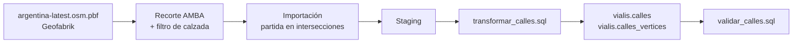

# Plan: construcción de la red vial ruteable

**Alcance:** obtención, transformación, almacenamiento y validación del grafo de
calles del AMBA  
**Requerimiento que habilita:** RF05 — desvíos por cortes
(`arquitectura_motor.md`, sección 13)  
**Estado:** plan, no iniciado

---

## 1. Qué entrega este plan y qué no

La sección 13 del documento de arquitectura describe cómo el motor debe trazar
una variante que esquive un corte. Todo ese cálculo se apoya en un dato que hoy
no existe: una red vial sobre la que se pueda rutear.

**Entregable:** `vialis.calles` y `vialis.calles_vertices` cargadas, validadas y
documentadas, con su pipeline versionado en `sql/calles/`, de modo que un
`pgr_dijkstra` entre dos paradas devuelva un camino correcto.

**Fuera de alcance de este plan**, en orden de dependencia:

1. El repositorio Go que consulta el grafo (`internal/database/postgres`).
2. La generación de la variante y el descarte de paradas no cubiertas
   (`internal/detour` o similar).
3. El endpoint HTTP y su contrato en `docs/openapi.yaml`.
4. La integración con la API de negocio.

Se separan a propósito: el grafo se puede validar solo, contra datos que el
motor ya tiene, antes de que exista una línea de Go que dependa de él. Si el
grafo está mal, todo lo que venga después hereda el error disfrazado de
resultado.

---

## 2. Decisiones a cerrar antes de empezar

Cada una cambia el pipeline. Van con la recomendación, pero hay que confirmarlas.

| # | Decisión | Recomendación |
|---|---|---|
| D1 | Extensión geográfica del extracto | Unión de CABA + 40 municipios oficiales, con 10 km de margen |
| D2 | Qué clases de `highway` entran | Calzada vehicular, sin `service` ni `track` |
| D3 | Qué hacer con las islas del grafo | Conservar sólo la componente principal, informando cuánto se descartó |
| D4 | `oneway=reversible` / `alternating` | Tratar como bidireccional y dejarlo documentado |
| D5 | Restricciones de giro (relaciones OSM) | Fuera de la primera versión; ya está declarado como limitación en 13.9 |
| D6 | Dónde se registra la fecha del extracto | Tabla `vialis.calles_metadata` |

### D1 — Extensión geográfica

Se adopta la definición oficial de AMBA publicada por el Estado nacional: CABA
más 40 municipios bonaerenses. El límite versionado es la unión de las
geometrías administrativas de GeoRef/IGN y se expande con un buffer geodésico
de 10 km. Los archivos fuente y derivado están en
`sql/calles/amba-jurisdicciones.geojson` y
`sql/calles/amba-margen-10km.geojson`.

El margen no es opcional. Un desvío cerca del borde del recorte necesita calles
que están del otro lado: sin margen, el ruteo falla o rodea de más justo en la
periferia, que es donde menos alternativas hay. Un recorte ajustado al AMBA
produciría desvíos peores en el conurbano que en el centro, y por un artefacto
del recorte, no por la red real.

### D2 — Clases de calle

Entran `motorway`, `trunk`, `primary`, `secondary`, `tertiary`, `unclassified`,
`residential`, `living_street` y sus `_link`. Quedan afuera `footway`,
`cycleway`, `steps`, `path`, `pedestrian` y `track`.

`service` es el caso dudoso: son entradas de garaje, playas de estacionamiento y
calles internas. Un colectivo no circula por ahí, y dejarlas entrar habilita
desvíos que atraviesan un estacionamiento porque son cien metros más cortos.
Recomiendo excluirlas.

También hay que respetar `access=no` y `motor_vehicle=no`.

### D3 — Islas del grafo

Todo grafo importado de OSM tiene fragmentos desconectados: errores de mapeo,
calles cortadas por el borde del recorte, geometrías sueltas. Una parada que
engancha con un vértice de una isla produce un "no hay camino" que parece un
problema del corte y en realidad es un problema del dato.

Conservar sólo la componente conexa principal evita esa clase de falla confusa.
La cantidad descartada tiene que quedar informada: si es más del 1 %, hay algo
mal en el filtrado, no en OSM.

---

## 3. Pipeline



Es el mismo patrón de `sql/recorridos/`: crudo con los nombres del origen →
transformación versionada → tablas finales con las convenciones de Vialis.

---

## 4. Fase 1 — Extracto

```bash
# 1. Descargar el extracto de Argentina
wget https://download.geofabrik.de/south-america/argentina-latest.osm.pbf

# 2. Recortar al AMBA con margen (D1)
osmium extract --bbox <caja AMBA + margen> \
    argentina-latest.osm.pbf -o amba.osm.pbf

# 3. Filtrar a calzada vehicular (D2)
osmium tags-filter amba.osm.pbf \
    w/highway=motorway,trunk,primary,secondary,tertiary,unclassified,residential,living_street,motorway_link,trunk_link,primary_link,secondary_link,tertiary_link \
    -o amba-calles.osm.pbf
```

**Registrar como procedencia**: URL de origen, fecha de descarga, checksum del
archivo y la caja usada. La sección 15.4 dice que la antigüedad de la red se
traslada a la calidad del desvío; para que eso sea verificable y no folklore,
el dato tiene que estar guardado (D6).

**Verificación de salida:** `osmium fileinfo -e amba-calles.osm.pbf` devuelve
una cantidad de ways razonable y una caja que cubre lo esperado.

---

## 5. Fase 2 — Importación

### El punto crítico: dónde se parten las calles

Un `way` de OSM puede abarcar muchas cuadras seguidas. El grafo necesita una
arista por tramo entre intersecciones consecutivas, así que hay que partirlas.
**Cómo se parten no es indistinto.**

Partir por geometría —`ST_Node`, `pgr_nodeNetwork`— crea un vértice en cada
cruce de líneas. Pero en OSM dos calles que se cruzan **sin conectarse**, como
un puente sobre una avenida o un paso bajo nivel, también se cruzan
geométricamente: están diferenciadas por `layer`, `bridge` y `tunnel`, y sobre
todo por no compartir ningún nodo. El noding geométrico inventa ahí una
conexión que no existe, y el resultado son desvíos que se bajan de una autopista
para seguir por la calle que pasa por debajo.

Partir por **nodos compartidos de OSM** es topológicamente exacto: una
intersección real es un nodo referenciado por dos o más ways, y un cruce a
distinto nivel no lo es.

Esto corrige lo que había sugerido antes: `pgr_nodeNetwork` no debería usarse
sobre ways de OSM.

### Herramienta

**`osm2pgrouting`**, porque parte por nodos compartidos, escribe `cost` y
`reverse_cost` con la convención de pgRouting, y toma su configuración de un
`mapconfig.xml` explícito y versionable — que encaja con cómo este repositorio
trata la configuración en general.

Consideraciones:

- Lee XML, no `.pbf`: hay que convertir con `osmium cat -o amba-calles.osm
  amba-calles.osm.pbf`.
- Es pesado en memoria. Sobre un extracto del AMBA debería andar, pero hay que
  medirlo antes de asumirlo.
- `osm2po` es la alternativa si la memoria resulta un problema: lee `.pbf`
  directo, es más rápido y también parte correctamente.

Importa a su propio esquema. Ese esquema es el **staging**, no el resultado: la
transformación lo lleva a las convenciones de Vialis.

**Entregable:** `sql/calles/crear_calles_raw.sql` y el `mapconfig.xml`, más el
comando de carga documentado en el README.

---

## 6. Fase 3 — Transformación

**Entregable:** `sql/calles/transformar_calles.sql`.

```sql
CREATE EXTENSION IF NOT EXISTS pgrouting;

CREATE TABLE vialis.calles (
    id_calle       BIGINT GENERATED BY DEFAULT AS IDENTITY PRIMARY KEY,
    osm_way_id     BIGINT NOT NULL,
    nombre         TEXT,
    tipo           TEXT NOT NULL,
    origen         BIGINT NOT NULL,
    destino        BIGINT NOT NULL,
    costo          DOUBLE PRECISION NOT NULL,
    costo_inverso  DOUBLE PRECISION NOT NULL,
    geom           GEOMETRY(LineString, 4326) NOT NULL
);

CREATE INDEX idx_calles_geom    ON vialis.calles USING GIST (geom);
CREATE INDEX idx_calles_origen  ON vialis.calles (origen);
CREATE INDEX idx_calles_destino ON vialis.calles (destino);
```

Pasos:

1. **Filtrar** a lo decidido en D2, incluyendo `access` y `motor_vehicle`.
2. **Costear**: `costo` es el largo geodésico en metros
   (`ST_Length(geom::geography)`), nunca segundos. Es consecuencia directa de la
   sección 13.5: la red contesta *por dónde*, y el tiempo lo sigue aportando
   GTFS.
3. **Aplicar el sentido**: `oneway=yes` deja `costo_inverso = -1`; `oneway=-1`
   invierte; `junction=roundabout` implica sentido único aunque no lo declare.
   Un costo negativo es la forma en que pgRouting expresa "no transitable en esa
   dirección", así que el sentido queda en el dato y no en la lógica de cada
   consulta.
4. **Materializar vértices** en `vialis.calles_vertices` y completar
   `origen`/`destino`. Se calcula una vez en la carga, nunca por consulta: es el
   principio de la sección 15.5.
5. **Podar islas** según D3, dejando registrada la proporción descartada.
6. **Registrar procedencia** en `vialis.calles_metadata`: fecha del extracto,
   fuente, caja, cantidad de aristas y vértices resultantes.

El script debe ser **re-ejecutable y reemplazante**, como `transformar_gtfs.sql`:
rehace `calles` y `calles_vertices` y no toca `viajes`, la matriz OD, `tarifas`
ni `recorridos`.

---

## 7. Fase 4 — Validación

La parte que decide si el grafo sirve. **Entregable:**
`sql/calles/validar_calles.sql`, que corre después de cada carga.

### 7.1. Integridad estructural

| Chequeo | Criterio de aprobación |
|---|---|
| Costos | Ninguno nulo; ninguno cero; `costo > 0` siempre |
| Vértices | Todo `origen`/`destino` existe en `calles_vertices` |
| Geometría | Toda `geom` válida, sin `LineString` de un solo punto |
| Duplicados | Ninguna arista repetida entre el mismo par de vértices con la misma geometría |
| Componente principal | ≥ 99 % de las aristas dentro de la componente conexa mayor |

### 7.2. Que la partición sea correcta

El chequeo específico del riesgo de la fase 2: buscar pares de aristas que se
crucen geométricamente sin compartir vértice, y verificar que **todos** los
casos sean cruces a distinto nivel (`bridge`, `tunnel` o `layer` distinto). Si
aparece un cruce a nivel sin vértice compartido, la partición falló y el grafo
tiene una intersección que el ruteo no puede usar.

### 7.3. Cobertura contra las paradas reales

Acá está la ventaja de construir esto dentro del motor: ya hay datos con los que
contrastar.

Para cada parada de `vialis.paradas`, buscar la arista transitable más cercana.
La futura integración podrá proyectar la parada sobre esa arista y crear puntos
virtuales de entrada; exigir un vértice cercano penalizaría cuadras largas aunque
la calle pase junto a la parada.

- **Criterio:** más del 99 % de las paradas debe tener una arista a menos de
  50 metros.
- **Qué revela un fallo:** si una zona entera queda lejos, el filtrado de D2
  dejó afuera calles por las que efectivamente circulan colectivos.

### 7.4. Ruteo contra recorridos conocidos

La validación más fuerte disponible. El motor tiene la geometría real de unos
139.000 tramos de colectivo entre paradas consecutivas. Cada uno es un camino
que un colectivo recorre de verdad.

Tomando una muestra de tramos de `vialis.recorridos_paradas`:

1. Rutear entre las dos paradas del tramo sobre el grafo, sin ningún corte.
2. Comparar el largo ruteado contra `distancia_hasta_siguiente_metros`.

| Señal | Interpretación |
|---|---|
| No hay camino | El grafo está roto o desconectado en esa zona |
| Ruteado ≫ real | Falta una calle, o un sentido único quedó mal aplicado |
| Ruteado ≪ real | El grafo permite un atajo que la calle real no permite: cruce falso o restricción de giro ausente |
| Ruteado ≈ real | El grafo reproduce el camino que usa el servicio existente |

**Criterio:** la mediana de la razón entre largo ruteado y largo real debe
quedar cerca de 1, y la proporción de tramos sin camino tiene que ser
prácticamente nula.

Esto no valida el desvío —todavía no existe— pero valida lo único que el desvío
necesita: que el grafo describa una ciudad por la que un colectivo puede
circular.

---

## 8. Fase 5 — Integración y documentación

- `sql/calles/README.md` con el orden de carga, al nivel de detalle de
  `sql/recorridos/README.md` y `sql/viajes/README.md`.
- `sql/init_db.sql`: agregar `create extension pgrouting`.
- `sql/ddl.sql`: incorporar las definiciones finales.
- `CLAUDE.md`: agregar `sql/calles/` a la sección del pipeline de datos.
- `docs/arquitectura_motor.md` §15.7: sacar la red vial de la lista de lo que
  falta cargar.

---

## 9. Riesgos

| Riesgo | Impacto | Mitigación |
|---|---|---|
| La imagen de PostgreSQL no trae pgRouting | Bloqueante | La imagen ya es un build no estándar, porque `postgis/postgis` tampoco trae h3; agregar pgRouting es el mismo trabajo. Confirmarlo antes de la fase 2 |
| Los tests de integración necesitan la extensión | Rompe CI | Alinear la imagen de test con la de desarrollo en la misma tarea |
| `osm2pgrouting` no entra en memoria | Retrasa la fase 2 | Cambiar a `osm2po` (D2 y el resto del pipeline no cambian) |
| Cobertura despareja de `oneway` en el conurbano | Desvíos contramano | Se mide en 7.4: un ruteado sistemáticamente más corto que el real delata sentidos faltantes. Queda como limitación documentada |
| El grafo entero es demasiado grande para rutear por consulta | Timeouts | Ya previsto: acotar por caja alrededor del tramo, con reintento ensanchado, como hace el estimador de tiempo |

---

## 10. Orden de trabajo

```text
D1..D6 cerradas
  → Fase 1  extracto + procedencia
  → Fase 2  importación partida en nodos OSM
  → Fase 3  transformar_calles.sql
  → Fase 4  validar_calles.sql   ← gate: no se sigue si no pasa
  → Fase 5  documentación e integración
```

La fase 4 es una puerta, no un trámite. Un grafo con cruces falsos o sentidos
mal aplicados no falla: rutea, y devuelve desvíos plausibles e imposibles de
operar. Eso es peor que no tener la función, porque el resultado no se ve mal.
