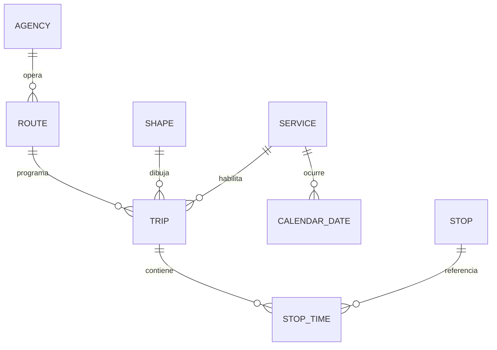
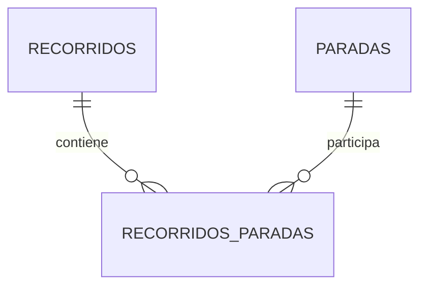
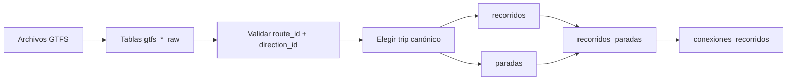

# Recorridos de colectivos: nombres y jerarquía

Este módulo importa un feed GTFS estático y lo transforma en el modelo de
recorridos utilizado por Vialis. El proceso conserva los identificadores GTFS
para poder rastrear cada dato hasta su archivo de origen.

El feed no está versionado. Se descarga como paquete completo desde la
publicación [Colectivos: GTFS](https://data.buenosaires.gob.ar/dataset/colectivos-gtfs)
o se obtiene como snapshot externo compatible, y se extrae en
`colectivos-gtfs/`. La carga requiere juntos los siete archivos enumerados más
abajo; no puede reconstruir los faltantes a partir de los demás.

## Jerarquía de GTFS

GTFS no relaciona una línea directamente con sus paradas. La relación atraviesa
los viajes programados y los horarios de parada:



La lectura de la jerarquía es:

1. Una `agency` es una empresa operadora.
2. Una `route` representa una línea o ramal publicado.
3. Un `trip` es una salida programada de esa ruta en una dirección determinada.
4. Un `stop_time` es la aparición ordenada de una parada dentro de un viaje.
5. Un `stop` representa una parada física, reutilizable por muchos viajes.
6. Un `shape` contiene los puntos que forman la geometría del recorrido.
7. Un `service_id` identifica los días en los que se ejecutan los viajes.

`SERVICE` es una entidad lógica en el diagrama: en este feed se materializa
mediante `service_id` y `calendar_dates.txt`, sin un archivo `calendar.txt`.

## Significado de los archivos y tablas raw

Las tablas de importación usan el prefijo `gtfs_` y el sufijo `_raw`. Sus
columnas mantienen los nombres originales de GTFS y todavía no contienen
geometrías PostGIS.

| Archivo              | Tabla raw                        | Contenido principal                     |
|----------------------|----------------------------------|-----------------------------------------|
| `agency.txt`         | `vialis.gtfs_agency_raw`         | Empresas operadoras                     |
| `routes.txt`         | `vialis.gtfs_routes_raw`         | Líneas y ramales publicados             |
| `trips.txt`          | `vialis.gtfs_trips_raw`          | Viajes, dirección, destino y `shape_id` |
| `stops.txt`          | `vialis.gtfs_stops_raw`          | Paradas físicas y coordenadas           |
| `stop_times.txt`     | `vialis.gtfs_stop_times_raw`     | Secuencia de paradas de cada viaje      |
| `shapes.txt`         | `vialis.gtfs_shapes_raw`         | Puntos ordenados de cada geometría      |
| `calendar_dates.txt` | `vialis.gtfs_calendar_dates_raw` | Fechas habilitadas por `service_id`     |

Las tablas raw son `UNLOGGED` porque son staging descartable: el importador las
elimina y recrea antes de cada carga completa. Los identificadores se almacenan
como `TEXT`, aunque algunos parezcan números, porque GTFS los define como valores
opacos.

## Alcance territorial y exclusión de Junín

El feed nacional contiene servicios que no pertenecen al área operativa de
Vialis. La transformación excluye `agency_id=446`, correspondiente en el feed
vigente a `TRANSPORTE 8 DE OCTUBRE S.A.`, porque sus servicios urbanos de Junín
quedan completamente fuera del polígono versionado AMBA + 10 km de
`sql/calles/amba-margen-10km.geojson`.

La agencia contiene cuatro rutas GTFS:

| `route_id` | Nombre | Recorridos por dirección |
|------------|--------|---------------------------|
| `6320` | `VERDE` | 2 |
| `6351` | `ROJA` | 2 |
| `6352` | `AZUL1` | 1 |
| `6353` | `AZUL2` | 1 |

En total se excluyen seis recorridos finales y sus paradas que no sean usadas
por otro servicio elegible. Las filas raw se conservan sin cambios para mantener
el feed importado íntegro y auditable; el filtro se aplica al construir los
viajes canónicos en `transformar_gtfs.sql`.

La exclusión se realiza por agencia, no por nombre visible ni por geometría
calculada durante cada carga. Esto evita depender del nombre de las líneas y
mantiene el pipeline determinista. Si el proveedor reasigna el identificador de
la agencia, esta regla debe revisarse junto con la actualización del feed.


## Qué significa cada nombre GTFS

### `route_id`

Identifica de manera estable una fila de `routes.txt`. En este feed representa
un ramal publicado, pero no incluye la dirección. Se conserva en
`recorridos.gtfs_route_id`.

### `route_short_name`

Es el nombre visible para el usuario, por ejemplo `7A`, `505R3`, `AZUL1` u
`OE16V`. Se conserva completo en `recorridos.nombre_publico`.

La transformación también genera dos campos derivados:

- `linea`: prefijo numérico o alfabético inicial.
- `ramal`: sufijo restante; si no existe, se usa `TRONCAL`.

Ejemplos:

| `route_short_name` | `linea` | `ramal`   |
|--------------------|---------|-----------|
| `7A`               | `7`     | `A`       |
| `505R3`            | `505`   | `R3`      |
| `AZUL1`            | `AZUL`  | `1`       |
| `ROJA`             | `ROJA`  | `TRONCAL` |
| `OE16V`            | `OE`    | `16V`     |

La separación es una convención de Vialis, no una regla definida por GTFS. Por
eso `nombre_publico` conserva siempre el valor original.

### `trip_id`

Identifica una salida programada. Diferentes `trip_id` pueden repetir exactamente
la misma geometría y secuencia de paradas, cambiando solamente sus horarios. No
se guarda como entidad final porque el objetivo de este módulo es obtener la
topología del recorrido, no cada servicio horario.

### `direction_id`

Distingue las dos direcciones de una ruta. Vialis conserva directamente `0` y
`1`; no los traduce a IDA/VUELTA porque GTFS no asigna ese significado.

### `trip_headsign`

Describe el destino anunciado del viaje, por ejemplo `a Retiro`. Se guarda en
`recorridos.destino` y ayuda a interpretar cada `direction_id`.

### `shape_id`

Identifica la geometría utilizada por un viaje. Los puntos de `shapes.txt` se
ordenan por `shape_pt_sequence` para construir un `LineString`. El valor original
se conserva en `recorridos.gtfs_shape_id`.

### `stop_id` y `stop_sequence`

`stop_id` identifica una parada física. `stop_sequence` indica su posición
dentro de un viaje y solo tiene sentido junto con un `trip_id`.

Por ese motivo, `stop_id` se transforma en una fila de `paradas`, mientras que
`stop_sequence` se guarda como `recorridos_paradas.nro_parada`.

## Jerarquía del modelo Vialis



### `vialis.recorridos`

Representa un ramal en una dirección. Su identidad lógica es:

```text
gtfs_route_id + direction_id
```

Para este feed, cada combinación tiene exactamente un `shape_id`. La
transformación valida esa condición y se detiene si un feed futuro contiene más
de una geometría para la misma combinación.

Como existen muchos viajes programados por recorrido, se elige un viaje
canónico con estas prioridades:

1. Mayor cantidad de paradas.
2. Mayor duración programada.
3. Menor `trip_id` en orden textual, como desempate determinista.

`tiempo_total_minutos` no se toma solamente del viaje canónico: se calcula como
la mediana de las duraciones de todos los viajes del mismo
`route_id + direction_id`.

### `vialis.paradas`

Representa una parada física única. Una parada puede aparecer en muchos
recorridos, por lo que no contiene una clave foránea directa a `recorridos`.

| Columna        | Significado                            |
|----------------|----------------------------------------|
| `id_parada`    | Identificador interno de Vialis        |
| `gtfs_stop_id` | Identificador original de GTFS         |
| `codigo`       | Código público de la parada, si existe |
| `nombre`       | Nombre procedente de `stops.txt`       |
| `posicion`     | Punto PostGIS con SRID 4326            |

### `vialis.recorridos_paradas`

Es la relación ordenada entre recorridos y paradas. Permite reutilizar una misma
parada física sin duplicar su nombre ni sus coordenadas.

| Columna                            | Significado                                 |
|------------------------------------|---------------------------------------------|
| `id_recorrido`                     | Recorrido al que pertenece la aparición     |
| `id_parada`                        | Parada física referenciada                  |
| `nro_parada`                       | Orden procedente de `stop_sequence`         |
| `tramo_hasta_siguiente`            | Porción del `shape` hasta la próxima parada |
| `distancia_hasta_siguiente_metros` | Longitud geográfica de ese tramo            |
| `tiempo_valle_hasta_siguiente_segundos` | Percentil 25 del tiempo comercial programado |
| `tiempo_tipico_hasta_siguiente_segundos` | Mediana del tiempo comercial programado |
| `tiempo_pico_hasta_siguiente_segundos` | Percentil 75 del tiempo comercial programado |
| `cantidad_muestras_tiempo`         | Viajes GTFS utilizados para los percentiles |

La última parada de cada recorrido tiene el tramo, la distancia y los tiempos
en `NULL`, ya que no existe una parada siguiente.

### Ubicación de las paradas sobre el recorrido

Para cortar `tramo_hasta_siguiente` hay que saber en qué fracción del `shape`
cae cada parada. `ST_LineLocatePoint` devuelve la proyección **más cercana**, y
esa respuesta es ambigua cuando el recorrido pasa dos veces por el mismo lugar:
la parada se engancha a la pasada equivocada, la fracción retrocede y el tramo
se descarta por quedar invertido.

Por eso las paradas se ubican de forma **monótona**: cada parada se busca
únicamente sobre el tramo de `shape` que queda por delante de la anterior
(`ST_LineSubstring(geom, fraccion_anterior, 1)`), lo que respeta el orden de la
ruta. Los tres casos que esto resuelve, medidos sobre el feed del AMBA:

| Caso                  | Ejemplo                        | Qué pasaba sin ubicación monótona                                     |
|-----------------------|--------------------------------|-----------------------------------------------------------------------|
| Recorrido circular    | `AZUL1` (11,5 km, inicio = fin)| La última parada **es** el punto de inicio y proyectaba en `0.0`      |
| Pasada equivocada     | `79J`, `395B`                  | El recorrido vuelve a un corredor ya transitado: retrocesos de 12-46 km |
| Retroceso corto       | `91E`, `91B`                   | El recorrido dobla sobre sí mismo: retrocesos de 427 y 683 m          |

La auto-intersección por sí sola no es el problema: 500 de los 2.066 recorridos
tienen `shape` no simple y solo 5 se rompían.

El caso base de la recursión clampea la fracción a 1 en lugar de cortar. Si
cortara, las paradas posteriores quedarían sin fila y desaparecerían de
`recorridos_paradas`; clampeando conservan su fila y su tramo queda en `NULL`,
que es la degradación correcta.

### Saltos del shape

El feed trae viajes canónicos cosidos: dos pedazos de recorrido unidos en un
mismo `trip_id` por una recta que no sigue ninguna calle. En `129H` dirección 1
(«H - Pza. de Miserere»), `stop_times.txt` y `shapes.txt` coinciden: el viaje va
de Florencio Varela a Miserere (paradas 1-47), el shape salta 18,8 km en línea
recta de vuelta a Florencio Varela (`shape_pt_sequence` 298 → 299) y la
secuencia sigue por Ing. Allan hasta terminar a 700 m de donde empezó. Los 241
viajes de esa dirección tienen las mismas 90 paradas, así que no hay otro viaje
canónico que elegir: el defecto está en el origen, no en la selección.

Un tramo que contiene un segmento recto de más de **8 km** se guarda en `NULL`,
igual que uno invertido. Así no entra como referencia de tiempos de viaje y
`GET /lines/{id}` devuelve el recorrido con `simulable: false` y ese tramo sin
`pathToNext`, en lugar de exportar una recta que cruza la ciudad: la línea se
puede dibujar con el hueco, pero no simular. El umbral sale del feed vigente:

| Caso                   | Recorridos                             | Segmento recto más largo |
|------------------------|----------------------------------------|--------------------------|
| Viaje cosido           | `129F`/1, `129H`/1, `179C`/1, `123A`/0 | 10,2 a 35 km             |
| Recta de ruta legítima | `276I`, `307F`                         | 3,8 a 6,5 km             |

Un salto no siempre queda entero en un tramo. El cosido de `129H`/1 sigue
después del salto de 18,8 km con dos rectas de dos puntos: una de 4,05 km
(Calchaquí 1999 → Calchaquí 450, tramo 48) y otra de 11,6 km (tramo 49), que la
regla de 8 km descarta. Los tramos 47 y 49 quedan en `NULL` y el 48 quedaría
como una isla recta en el mapa. Por eso además se descarta un tramo con un
segmento recto de más de **3 km** que linda con un tramo ya descartado (el
anterior o el siguiente; el `NULL` de la última parada no cuenta). Una recta de
ruta legítima nunca linda con uno: en el feed vigente la regla alcanza sólo al
tramo 48 de `129H`/1. Las rectas de más de 3 km que siguen quedando
(`79J`/0, `123A`/0, `257A`/1, `276I`, `307F`) no tocan ningún tramo
descartado.

La regla descarta el tramo y no intenta recomponer el viaje: reordenar las
paradas o inventar la geometría faltante sería adivinar la ruta real.

### Lazos del shape sin paradas

Otros shapes recorren un lazo que ninguna parada del viaje usa. En `79J`
dirección 0 («J - Burzaco») el shape 326 da una vuelta completa Constitución →
Burzaco → Barracas entre las paradas 7 (889 Pinedo) y 8 (2382 Australia), que
están a 300 m, y recién después hace el recorrido con paradas: el tramo mide 46
km. No es un error de ubicación de la parada: el `shape_dist_traveled` de
`stop_times.txt` ubica la parada 8 en 48.272 m, el mismo lugar que la ubicación
monótona, y en los ocho recorridos afectados las dos ubicaciones difieren en
menos de 100 m sobre 30 a 93 km. Ubicar cada parada en la primera pasada del
shape en vez de la más cercana tampoco sirve: el lazo sobrante no desaparece,
se muda a otro tramo. El horario tampoco lo recorre: implica velocidades de 83
a 646 km/h en siete de los ocho tramos, contra 17-63 km/h en el resto de cada
línea.

Un tramo de más de **4,5 km** que mide más de **cinco veces** la distancia en
línea recta entre sus paradas se guarda en `NULL`, con la misma consecuencia que
un salto. En el feed vigente:

| Caso                      | Recorridos                                                                     | Tramo        | Cociente  |
|---------------------------|--------------------------------------------------------------------------------|--------------|-----------|
| Lazo sin paradas          | `79J`/0, `257A`/1, `395B`/1, `395C`/0, `395C`/1, `463A`/0, `463A`/1, `721B`/0 | 5,1 a 46 km  | 9,9 a 156 |
| Rulo de cabecera legítimo | `79E`/1, `177A`/0, `315A`/0, `371N`, `723B`/1 y otros                          | hasta 3,9 km | hasta 266 |
| Tramo largo legítimo      | `365R5`/0                                                                      | 6,8 km       | 3,1       |

### Tiempo comercial por tramo

Los percentiles se calculan solamente con viajes cuya secuencia completa de
paradas coincide con la del viaje canónico. Esto evita mezclar servicios
parciales o variantes con posiciones incompatibles.

Para un tramo intermedio se mide desde la salida de la parada actual hasta la
salida de la siguiente, incorporando la detención programada en esa parada. En
el último tramo se termina en la llegada final para no sumar una detención
posterior al recorrido. Las muestras no positivas se descartan.

Los escenarios representan variabilidad de horarios GTFS programados. No son
mediciones de tránsito en tiempo real ni garantizan que un viaje haya ocurrido
con esa duración.

### `vialis.conexiones_recorridos`

Es el grafo de trasbordos: qué pares de recorridos permiten cambiar de colectivo,
y dónde. Lo consume `GET /transfers` para armar los itinerarios factibles de una
combinación origen-destino.

| Columna                     | Significado                                          |
|-----------------------------|------------------------------------------------------|
| `id_recorrido_origen`       | Recorrido en el que se viene viajando                |
| `id_recorrido_destino`      | Recorrido que se toma después                        |
| `id_parada_bajada`          | Parada del primer recorrido donde se baja            |
| `id_parada_subida`          | Parada del segundo recorrido donde se sube           |
| `distancia_caminata_metros` | Distancia entre ambas paradas; 0 si son la misma     |

El par es **ordenado**. La factibilidad de un itinerario depende del sentido: el
trasbordo tiene que caer después de donde la persona subió al primer recorrido y
antes de donde baja del segundo, y esa pregunta no es simétrica.

Dos recorridos se consideran conectados cuando alguna parada de uno queda a
**300 metros o menos** de alguna parada del otro. No se exige la misma parada
física porque el feed del AMBA le da un `stop_id` propio a cada línea aunque
paren en la misma esquina: exigirla perdería la mayoría de las combinaciones
reales. El caso de la parada compartida queda incluido, con distancia 0.

Ese radio es el del ETL y no debe confundirse con
`config.TransfersAccessRadiusMeters`, que mide de una celda H3 a una parada para
decidir qué recorridos sirven esa celda. Son preguntas distintas y se mueven por
separado.

#### Un único punto de trasbordo por par

La tabla guarda solo el punto de menor caminata de cada par. Guardarlos todos
multiplicaría las filas por la cantidad de esquinas que dos recorridos comparten,
que en el AMBA son decenas.

La consecuencia hay que tenerla presente: un par puede descartarse por orden
—porque ese punto en particular cae antes de donde la persona sube, o después de
donde baja— aunque otro punto de trasbordo del mismo par sí lo respetara. El
resultado subestima itinerarios; nunca inventa uno que no exista.

El desempate entre puntos a igual distancia es determinista, por identificador de
parada, para que dos corridas sobre los mismos datos den lo mismo.

## Flujo de transformación



Los scripts se ejecutan en este orden:

1. `crear_gtfs_raw.sql`: recrea las tablas staging.
2. Importación de los siete archivos de `colectivos-gtfs/` en sus tablas raw.
3. `transformar_gtfs.sql`: crea índices, valida el feed y reemplaza los datos de
   las tablas finales.
4. `conexiones_recorridos.sql`: calcula entre qué pares de recorridos se puede
   trasbordar. Necesita `recorridos`, `paradas` y `recorridos_paradas` ya
   pobladas, así que va después del paso 3.

Los cuatro pasos los ejecuta el inicializador, que arma la base entera:

```bash
docker compose up -d --build
go run ./cmd/initdb
```

La importación del paso 2 la hace `internal/database/bootstrap`, que copia cada
archivo con `COPY` en la tabla que le asigna la tabla de correspondencias de más
arriba,
respetando el orden de columnas de `crear_gtfs_raw.sql`. No hay un script
`psql \copy` aparte: el orden del pipeline vive en un solo lugar.

Para inspeccionar las tablas raw antes de reemplazar el modelo final, se puede
ejecutar `transformar_gtfs.sql` a mano con `psql` después de una corrida.

En una base creada antes de incorporar los tiempos por tramo, ejecutar primero
`migrar_tiempos_tramos.sql` y luego volver a ejecutar `transformar_gtfs.sql`.

En una base creada antes de `POST /lines/similar`, ejecutar
`migrar_indice_geografia_recorridos.sql`. Sólo agrega el índice GIST sobre
`geom::geography` que necesita el prefiltro en metros de la búsqueda de
corredores: no recalcula nada, así que no hace falta volver a transformar.

## Datos que no provienen de GTFS

Los campos `caudal_pasajeros` e `ingreso_economico` permanecen en `NULL`. GTFS
describe oferta de transporte, horarios y topología, pero no contiene pasajeros
transportados ni recaudación. Esos valores deben incorporarse desde otra fuente.
