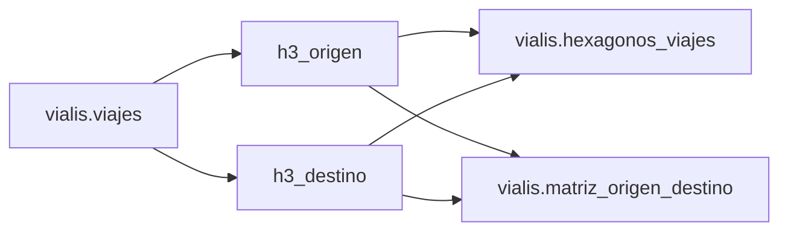
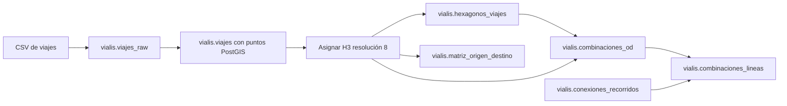

# Viajes y hexágonos H3

Este módulo importa viajes de transporte público y genera una representación
espacial agregada mediante celdas H3. La carga utilizada por Vialis representa
un día hábil típico de viajes con foco en CABA: no es un registro en tiempo real
ni una serie histórica de viajes ocurridos en una fecha calendario concreta.

Los campos de origen siguen el conjunto de datos
[Viajes y etapas en transporte público del Área Metropolitana de Buenos Aires](https://data.buenosaires.gob.ar/dataset/viajes-etapas-transporte-publico),
elaborado a partir de SUBE. La fuente oficial tiene alcance AMBA; los scripts de
este módulo no aplican por sí mismos un recorte al límite de CABA, por lo que el
alcance geográfico efectivo depende del CSV cargado en `viajes_raw`.

## Viajes y etapas

Un viaje representa el desplazamiento completo inferido para una tarjeta SUBE.
Puede estar compuesto por una o más etapas, por ejemplo un colectivo seguido de
un subte. La tabla `viajes` conserva el origen y el destino del desplazamiento,
la cantidad de etapas de cada modo y atributos agregados de la persona asociada
a la tarjeta.


Una fila no equivale necesariamente a un solo viaje observado en la población.
Para producir estimaciones se debe utilizar `factor_expansion_viaje`: contar
filas describe la muestra, mientras que sumar el factor estima la cantidad de
viajes representados.

## Modelo espacial



Los índices `h3_origen` y `h3_destino` se calculan con resolución H3 8. En
`viajes` funcionan como referencias lógicas: el DDL actual no declara claves
foráneas desde esa tabla hacia `hexagonos_viajes`.

Las columnas H3 utilizan el tipo nativo `h3index`. Esto permite validar sus
valores y utilizarlos directamente con las funciones de la extensión, sin
conversiones intermedias a texto.

## `vialis.viajes`

Contiene una fila por viaje inferido en la carga del día típico. Las coordenadas
de origen y destino del CSV se convierten a puntos PostGIS y luego se indexan en
H3.

La tabla no posee actualmente una clave primaria. El par `id_tarjeta` e
`id_viaje` conserva los identificadores de la fuente y permite relacionar el
viaje con sus etapas cuando se dispone de la tabla de etapas.

| Columna                      | Significado                                                                       |
|------------------------------|-----------------------------------------------------------------------------------|
| `id_tarjeta`                 | Identificador enmascarado de la tarjeta SUBE                                      |
| `id_viaje`                   | Identificador del viaje asociado a la tarjeta                                     |
| `cantidad_etapas`            | Cantidad de etapas válidas y completas que forman el viaje                        |
| `rango_horario`              | Hora o franja horaria asignada al viaje por la fuente                             |
| `etapas_subte`               | Cantidad de etapas realizadas en subte                                            |
| `etapas_tren`                | Cantidad de etapas realizadas en tren                                             |
| `etapas_colectivo`           | Cantidad de etapas realizadas en colectivo                                        |
| `geom_origen`                | Punto de origen agregado, como `GEOMETRY(Point, 4326)`                            |
| `geom_destino`               | Punto de destino agregado, como `GEOMETRY(Point, 4326)`                           |
| `h3_origen`                  | Índice de la celda H3 de resolución 8 que contiene el origen                      |
| `h3_destino`                 | Índice de la celda H3 de resolución 8 que contiene el destino                     |
| `departamento_origen_viaje`  | Código censal del departamento de origen                                          |
| `departamento_destino_viaje` | Código censal del departamento de destino                                         |
| `factor_expansion_viaje`     | Peso utilizado para expandir el registro de la muestra a una estimación de viajes |
| `etapas_incompletas`         | Indicador de que alguna etapa no tiene un destino imputado                        |
| `genero`                     | Género registrado para la persona asociada a la tarjeta SUBE                      |
| `grupo_edad`                 | Grupo de edad de cinco años registrado para esa persona                           |

### Identificadores

`id_tarjeta` está enmascarado en la fuente. No identifica públicamente a una
persona ni debe interpretarse como el número físico de una tarjeta. `id_viaje`
se conserva junto con él para mantener la trazabilidad con las etapas.

### Geometrías

`geom_origen` y `geom_destino` se construyen con longitud como coordenada X y
latitud como coordenada Y, usando SRID 4326. Son ubicaciones agregadas por la
fuente y no deben interpretarse como domicilios o posiciones GPS exactas.

Los índices GiST `idx_viajes_geom_origen` e `idx_viajes_geom_destino` aceleran
filtros espaciales sobre ambos extremos del viaje.

### Factor de expansión

Para estimar viajes se suma el factor, no la cantidad de filas:

```sql
SELECT SUM(factor_expansion_viaje) AS viajes_estimados
FROM vialis.viajes;
```

La cantidad de registros y la estimación expandida responden preguntas
distintas. Si el factor es `NULL`, la fila no aporta peso a la construcción de
`hexagonos_viajes`, porque ese proceso lo reemplaza por cero.

### Datos incompletos y atributos demográficos

`etapas_incompletas` permite decidir si un viaje cuyo destino no pudo imputarse
por completo debe participar de un análisis. El esquema no define un catálogo
de valores para este indicador, `genero` ni `grupo_edad`; cualquier
interpretación de sus códigos debe validarse contra el archivo fuente cargado.

## `vialis.hexagonos_viajes`

Contiene una fila por celda H3 de resolución 8 observada como origen o destino.
No almacena el polígono de la celda: este puede derivarse cuando se consulta a
partir de `indice_h3`.

| Columna                     | Significado                                                                    |
|-----------------------------|--------------------------------------------------------------------------------|
| `indice_h3`                 | Identificador H3 de resolución 8 y clave primaria de la tabla                  |
| `punto_maxima_concurrencia` | Punto de origen o destino con mayor peso acumulado dentro de la celda          |
| `concurrencia`              | Suma de factores de expansión correspondiente únicamente al punto seleccionado |

### Cálculo del punto de máxima concurrencia

`hexagonos_viajes.sql` calcula cada fila de esta manera:

1. Une todos los orígenes y destinos en un único conjunto de eventos.
2. Asigna a cada evento el `factor_expansion_viaje` como peso; un factor `NULL`
   aporta cero.
3. Agrupa eventos de una misma celda que tengan exactamente la misma geometría.
4. Suma sus factores de expansión.
5. Selecciona el punto de mayor suma dentro de cada celda.
6. En caso de empate, prioriza el punto con más registros y luego aplica un
   desempate determinista por latitud y longitud.

Orígenes y destinos se consideran eventos independientes. Un viaje cuyo origen
y destino estén en la misma celda aporta dos eventos al cálculo.

Aunque el campo se denomina `concurrencia`, no representa personas presentes al
mismo tiempo: el cálculo actual no agrupa por `rango_horario`. Tampoco representa
la demanda total de la celda; representa solamente el peso acumulado en el punto
más concurrido de ella.

El script usa `ON CONFLICT` para insertar celdas nuevas y actualizar las ya
existentes. No elimina automáticamente celdas que hayan desaparecido de una
carga posterior.

### Visualización del hexágono

Para mostrar las celdas en el visor de geometrías de pgAdmin se deriva un
polígono PostGIS con SRID 4326:

```sql
SELECT
    indice_h3,
    punto_maxima_concurrencia,
    concurrencia,
    h3_cell_to_boundary_geometry(indice_h3) AS geom
FROM vialis.hexagonos_viajes;
```

El cast directo `indice_h3::geometry` representa el centro de la celda,
no su contorno. Para visualizar el área se debe usar
`h3_cell_to_boundary_geometry`.

## `vialis.combinaciones_od`

Contiene una fila por par de celdas y banda horaria, contando únicamente los
viajes que necesitaron combinar. Es la tabla que lee `GET /transfers`.

| Columna            | Significado                                                            |
|--------------------|------------------------------------------------------------------------|
| `h3_origen`        | Celda H3 de resolución 8 donde empezó el viaje                         |
| `h3_destino`       | Celda H3 de resolución 8 donde terminó                                 |
| `rango_horario`    | Hora del viaje, tal como la informa la fuente                          |
| `viajes_estimados` | Suma de factores de expansión de los viajes con trasbordo de ese grupo |

### Qué cuenta como combinación

`cantidad_etapas > 1`. La fuente no tiene tabla de etapas ni marca de trasbordo:
el único indicio de que la persona tuvo que combinar es que su viaje se compuso
de más de una etapa.

El filtro `etapas_colectivo = cantidad_etapas` deja solamente los viajes hechos
íntegramente en colectivo. El feed GTFS cargado es exclusivamente de colectivos,
de modo que un viaje que combinó colectivo con subte o tren produciría
itinerarios de colectivo para un trasbordo que nunca ocurrió entre colectivos.

### Lo que esta tabla no dice

No dice qué líneas se usaron ni dónde se hizo el trasbordo, porque la fuente no
lo registra en ninguna columna. `viajes_estimados` pertenece al par de celdas:
repartirlo entre las combinaciones de líneas que podrían haber servido el flujo
sería inventar un dato que la encuesta nunca tomó. Los itinerarios los deriva
`GET /transfers` cruzando esta tabla con `vialis.conexiones_recorridos`, y son
combinaciones posibles, no la que se usó.

A diferencia de `matriz_origen_destino`, esta tabla sí agrupa por
`rango_horario`: la pregunta que responde es de qué hora se trata.

## `vialis.combinaciones_lineas` y `vialis.combinaciones_lineas_flujos`

El ranking que lee `GET /transfers`: qué pares de líneas parece estar
combinando la gente, y cuántos viajes se le atribuyen a cada par.

### El reparto

La fuente no dice qué líneas usó nadie. `combinaciones_lineas.sql` reparte cada
flujo origen-destino en partes iguales entre las combinaciones factibles que
podrían haberlo servido: un flujo de 4.000 viajes con 4 combinaciones aporta
1.000 a cada una.

Eso es un supuesto declarado, no una medición, y la tabla lo dice de dos
maneras. `alternativas_promedio` guarda entre cuántas combinaciones se repartió
el volumen, ponderado por viajes: un par cuyo número salió de repartos entre dos
candidatos es una afirmación fuerte, y el mismo número repartido entre treinta es
una conjetura. `vialis.combinaciones_lineas_flujos` guarda los tres flujos más
grandes detrás de cada par, con su propio conteo de alternativas, para que la
afirmación se pueda auditar hasta el dato de origen.

### Qué se descarta

Un par de celdas que una sola línea ya cubre de punta a punta, **en el sentido
correcto**, no entra. Si una línea llega del origen al destino, ese trasbordo no
era obligatorio y el flujo no habla de un hueco de la red. Se exige el sentido
porque un recorrido que toca las dos celdas pero pasa primero por el destino no
lleva a nadie del origen al destino: el que sirve es el de la dirección opuesta,
que es otra fila de `vialis.recorridos` y se evalúa por su cuenta.

Tampoco entra un par de celdas sin ninguna combinación factible. La combinación
ocurrió, pero el feed GTFS —que es exclusivamente de colectivos— no puede
explicarla con dos colectivos.

### La banda horaria

`rango_horario` NULL es la fila del día entero y las 24 filas con hora son el
desglose. Se precalculan las dos cosas porque agrupar el desglose en cada
consulta para responder "todo el día" es justamente el trabajo que esta tabla
existe para evitar.

### Radios

Dos radios distintos intervienen y conviene no confundirlos:

| Radio | Dónde vive | Qué pregunta responde |
|-------|------------|------------------------|
| 400 m | `combinaciones_lineas.sql` | ¿Qué recorridos sirven esta celda? |
| 300 m | `sql/recorridos/conexiones_recorridos.sql` | ¿Se puede caminar de esta parada a esta otra? |
| 800 m | `internal/config` (`AccessRadiusMeters`) | ¿Podría alguien caminar hasta esa parada? (modelo de demanda) |

Los dos primeros viven en el ETL y no en `internal/config` porque la agregación
es batch: al momento de la consulta ya están decididos. Cambiar uno significa
reconstruir el agregado, no reiniciar el proceso.

El de 400 m es deliberadamente la mitad del que usa el modelo de demanda, y no
un descuido. Aquel pregunta si alguien *podría* caminar hasta una parada; este
pregunta qué línea *tomó*. Con 800 metros el AMBA devuelve una docena de líneas
por punta y el producto da **145 combinaciones factibles por par de celdas**,
medido sobre el dataset completo. Repartir un flujo entre 145 candidatos no
atribuye nada.

### Techo de alternativas

Un par de celdas con más de **10** combinaciones factibles no entra en el
ranking. La red le deja tantas opciones que atribuir sus viajes a un par sería
presentar un reparto como una observación.

La consecuencia hay que tenerla presente: **la suma de `viajes_estimados` no
reconstruye el total de viajes con trasbordo de la ciudad**, porque los flujos
por encima del techo quedan afuera a propósito. El ranking responde "qué
combinaciones fuerza la red", no "cuántos trasbordos hay".

`config.TransfersWeakEvidenceAlternatives` (5) marca la mitad superior de ese
rango como evidencia floja, y `TestTransfersPolicyIsCoherent` impide que el
umbral se vaya por encima de este techo, donde no podría dispararse nunca.

## Flujo de carga



Los scripts se utilizan en este orden:

1. `ddl.sql` crea las tablas finales.
2. `crear_viajes_raw.sql` crea la tabla de staging `viajes_raw`.
3. El inicializador copia `viajes_BAdata_20241016.csv` en `viajes_raw`.
4. `transformar_viajes.sql` actualiza las estadísticas, transforma las
   coordenadas en puntos, crea los índices espaciales y asigna las celdas H3.
5. `hexagonos_viajes.sql` calcula el punto de mayor peso de cada celda.
6. `matriz_origen_destino.sql` agrega los factores por par de celdas de origen y
   destino.
7. `combinaciones_od.sql` agrega los factores de los viajes que necesitaron
   trasbordo, por par de celdas y banda horaria. Va después de
   `hexagonos_viajes.sql` porque su clave foránea apunta a los hexágonos.
8. `combinaciones_lineas.sql` reparte esos flujos entre los pares de líneas que
   podrían haberlos servido. Es el único script que cruza los dos dominios de
   datos, así que necesita además `vialis.conexiones_recorridos` ya poblada
   (ver `sql/recorridos/README.md`).

La carga entera la ejecuta el inicializador, que es también quien intercala el
paso 3 entre los dos scripts:

```bash
docker compose up -d --build
go run ./cmd/initdb
```

La importación del CSV está entre dos scripts y no dentro de uno porque `COPY`
lee del cliente, no del servidor: `internal/database/bootstrap` abre el archivo,
lo transmite fila por fila y recién entonces ejecuta la transformación. Por eso
`importar_viajes.sql` se dividió en `crear_viajes_raw.sql` y
`transformar_viajes.sql`.
